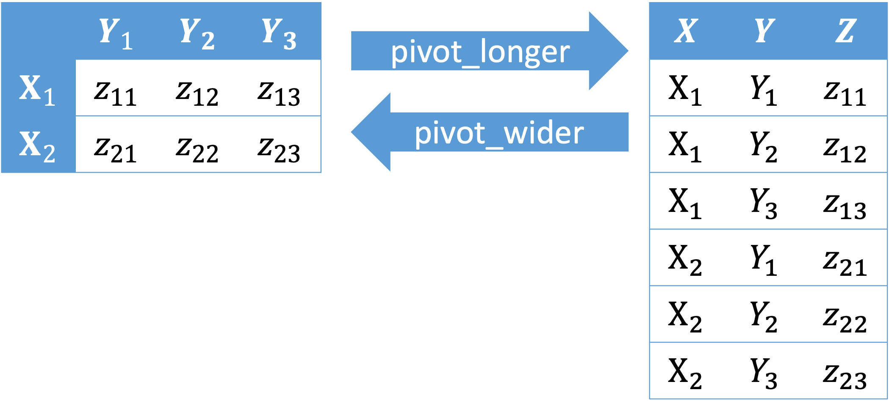

## Package

```{r load-package, message = FALSE}
library(tidyverse)
```

## Part 1: Pivoting 



- `pivot_longer()` "lengthens" data, increasing the number of rows and 
decreasing the number of columns.

```{r, eval = FALSE}
data_left %>% 
  pivot_longer(col = Y1:Y3, 
               names_to = "Y", 
               values_to = "Z")
```

- `pivot_wider()` "widens" data, increasing the number of columns and decreasing 
the number of rows.

```{r, eval = FALSE}
data_right %>% 
  pivot_wider(names_from = Y, 
              values_from = Z)
```

### Practice^[Source: https://tidyr.tidyverse.org/reference/pivot_wider.html, https://tidyr.tidyverse.org/reference/pivot_longer.html]

(1) Transform the dataset `relig_income` to one with columns `religion`, `income`, and `count` using either `pivot_wider()` or `pivot_longer()`.

```{r}
relig_income %>% 
  head()
```

(2) Transform the dataset `fish_encounters` to one with a matrix structure where 
rows indicate fish, columns indicate station, and each cell indicates whether each 
fish was seen in a certain station (1 if yes and 0 otherwise). Use either 
`pivot_wider()` or `pivot_longer()`.

```{r}
fish_encounters %>% 
  head()
```

(3) Transform the dataset `billboard` to one with columns `artist`, `track`, 
`data.entered`, `week`, and `rank`. Drop `NA` values for `rank`. Use `pivot_wider()` or `pivot_longer()`.
 
```{r}
billboard %>% 
  head()
```

## Part 2: Probability

Try [exercises](https://sta199-sp22-003.netlify.app/hw/hw03.html) originally 
developed by Prof. Alexander Fisher and ask me questions. 

## Part 3: Inference based on Simulations or Central Limit Theorem

This is originally developed by Prof. Becky Tang and has been slightly modified. 
Click [here](https://sta199-summer2021.github.io/website/hw/hw-02.html) to see the original homework. 

### Data

Postoperative sore throat is an annoying complication of intubation after 
surgery, particularly with wider gauge double-lumen tubes. Reutzler et al. 
(2013) performed an experimental study in Germany among patients having elective
surgery who required intubation with a double-lumen tube.
Prior to anesthesia, patients were randomly assigned to gargle either a licorice-based solution or sugar water (as placebo). 

Sore throat was evaluated 30 minutes, 90 minutes, and 4 hours 
after conclusion of the surgery, evaluated using a numeric scale from 0 to 10,
where 0 = no pain and 10 = worst pain. For the purposes of this assignment, we
will treat these pain scales as numeric.

The data are available in your assignment repository as a .csv file. Some 
relevant variables of interest are:

- `preOp_gender`: Gender (0 = Male; 1 = Female)
- `preOp_calcBMI`: Body mass index in kg/m$^2$
- `preOp_asa`: American Society of Anesthesiologists physical status 
classification (1 = normal healthy patient, 2 = mild systemic disease, 3 = 
severe systemic disease)
- `treat`: Treatment given (0 = Sugar placebo; 1 = Licorice solution)
- `pacu30min_throatPain`: Sore throat pain score 30 minutes after arrival in the post-anesthesia care unit (PACU)

### Exercises

**Overall hint:** When performing a hypothesis test, you must provide the 
significance level of your test, the null and alternative hypotheses, the 
p-value, your decision, and an interpretation of the p-value in context of the 
original research question. If you are using a **non**-simulation-based 
approach, you must also provide the value of your test statistic and the 
distribution of that test statistic assuming the null hypothesis is true.

**Overall hint:** To ensure reproducibility, for all exercises requiring a 
simulation-based approach, set a seed of your choice. Additionally, ensure that 
the number of repetitions is sufficiently large.

Be careful with missing values of the variables you're analyzing in each question!

1. Construct and interpret a 95% confidence interval for the mean sore throat 
pain score 30 minutes after arrival in the PACU among *all patients* using both
a simulation-based approach and a CLT-based approach. Compare these two 
intervals.

2. Suppose that these patients are representative of German patients undergoing 
surgeries that require intubation. Is there evidence that the mean BMI among
such patients differs from the mean BMI among all German adults of 26 kg/m$^2$?
Assess this hypothesis using a simulation-based approach. 
Provide a visualization of your simulated null distribution and observed data (sample statistic).

Now, let's examine any potential effects of licorice solution on reducing
throat pain after surgery.

3. Assess whether there was a lower mean throat pain 
score 30 minutes after surgery among patients who received licorice compared
to patients who received sugar solution placebo. Use a simulation-based approach.

4. Comprehensively assess whether a lower proportion of patients who received
licorice solution reported having any pain 30 minutes after surgery compared
to sugar solution. Use a simulation-based approach.

5. Based on your analyses, do you think that licorice gargle prior to surgery is
effective in reducing post-intubation sore throat? Explain your answer, 
referencing any data, formal statistical tests, or study design as necessary.

In Exercises 6 - 10, determine whether the statements are TRUE or FALSE. If the 
statement is FALSE, **explain why** it is FALSE.

The mean BMI among patients receiving licorice solution was 25.6 kg/m$^2$ and
the mean BMI among patients receiving sugar solution placebo was 25.6 kg/m$^2$.
In assessing whether there is a difference in mean BMI between the two treatment
groups using a CLT-based approach, the researchers obtained a p-value of 0.925.

6. If there is truly no difference in mean BMI between these two groups, then 
the probability of seeing a difference in BMI as large as our observed
difference or even larger is approximately 0.925.

7. Assuming $\alpha = 0.05$, then our p-value of 0.925 would be strong evidence
that there is no difference in the mean BMI between the two treatment groups.

8. The probability that we have made a Type 2 error is less than 10%.

9. If we were to repeatedly construct 95% confidence intervals for the 
difference in mean BMI in the same way from the original population, then we 
know that 95% of those intervals would truly contain the true population 
difference in means.

10. If we instead found a p-value of 0.021, then at the $\alpha = 0.05$ level,
we would have enough evidence to conclude that there is a difference in mean
BMI between the two treatment groups. 

## Submitting Application Exercises

- No need to submit anything 

