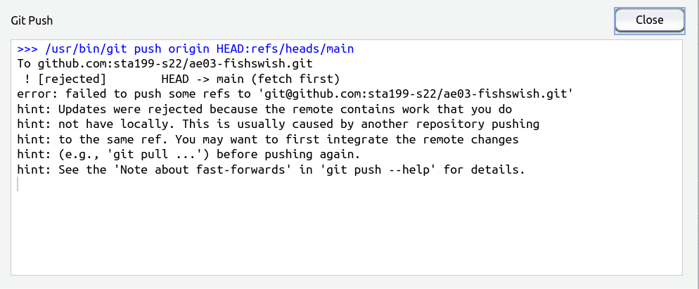

- [My push was rejected, what do I do?](#my-push-was-rejected-what-do-i-do)

## My push was rejected, what do I do?

This question is relevant if you received an error message like the one below:

**Solution**: Git Pull. In the upper right box of RStudio select "Git" and then click the "Git Pull arrow" as seen in the red box below.

Now you should be able to push.

**Why did this error occur?** 

This error occurs when the repository is changed *remotely*. In other words, the GitHub repostiory contains content that you do not have on your local file system. For example, if you go to the repository and change the README file and commit your changes, you will receive this error and need to *pull* the remote changes before you can *push* your local changes again.

---