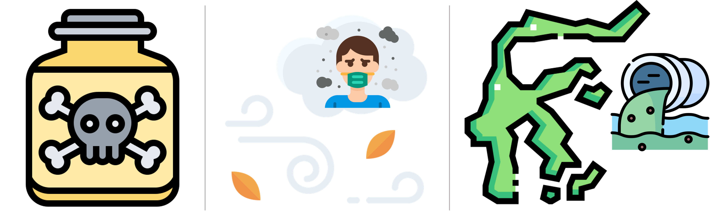

```{r child = "setup.Rmd"}
```

```{r echo=FALSE, message=FALSE, warning=FALSE}
library(tidyverse)
library(rvest)
library(magick)
```


## Teaching Team

### Instructor, Bora Jin

```{r research_interest, echo=FALSE, out.width = '95%'} 

``` 

- Office hours
  - Monday, Wednesday, Thursday at 11am - 12:15pm 
  - Old chem 003 
  
---

## Teaching Team

### TA, 

- photo
- Office hours
  - TBD

---

class: middle, center

# Data Science

---

## What is Data Science?

--

- Data science is using data to understand the world.

- We're going to learn to do this in a principled and `tidy` way -- more on that later!

- This is a course on introduction to data science, with an emphasis on statistical thinking.

---

## Course FAQ

**Q - What data science background does this course assume?**
A - None.

<br>

**Q - Is this an intro stat course?**
A - Not a traditional one. While statistics $\neq$ data science, they are very closely related and have tremendous of overlap. Hence, this course is a great way to get started with statistics.

<br>

**Q - Will we be doing computing?**
A - Yes. We will use the computing language R.

---

## Course Learning Objectives

- Learn to explore, visualize, and analyze data in a *reproducible* and *shareable* manner.

- Gain experience in data wrangling, exploratory data analysis, predictive modeling, and data visualization.

- Develop your own question(s) about data and use statistical techniques to answer the question(s).

- Practice effective oral and written communication of results. 

---

## Some of What You Will Learn

.pull-left[
- Fundamentals of `R`

- Version control with `GitHub`

- Reproducible reports with `R Markdown`

- Data visualization and wrangling with `ggplot2` and `dplyr` from the `tidyverse`

<!-- - Web based applications with `RShiny` -->

]

.pull-right[
- Data types and functions

- Spatial data visualization

- Regression

- Statistical inference
]

---

## Examples of Data Science in Practice

- [Russian Invasion of Ukraine](https://www.bloomberg.com/graphics/2022-ukraine-russia-us-nato-conflict/)

- [What Redisctricting Looks Like in Every State](https://projects.fivethirtyeight.com/redistricting-2022-maps/)

- [Tracking Sleep with Apple Watch](https://towardsdatascience.com/what-i-learned-by-tracking-my-sleep-with-apple-watch-bea2caa49a47)

- [Infectious Disease Tracker](https://nextstrain.org)

---

## Time for an Analysis!

- Let's look at the [UN vote analysis](https://sta199-summer22.netlify.app/appex/ae01_BJ.html).

```{r echo = F}
countdown::countdown(minutes = 5, seconds = 0)
```

---

class: middle, center

# The Course

---

## Class Meetings 

Summer courses require a high-level of commitment: "a **minimum** of 25 hours per week" based on [Credit Hour Policy](https://registrar.duke.edu/policies/credit-hour-policy)

**Lecture**
  - Monday to Friday at 9:30am - 10:45am, Old Chem 003 
  - Focus on concepts behind data analysis
  - **Important:** Videos & readings before lecture (*Prepare* column on course schedule)
  - Interactive lecture including examples and hands-on exercises
  - Bring fully-charged laptop to every lecture -- Please let me know as soon as possible if you do not have access to a laptop.

---

## Class Meetings 

Summer courses require a high-level of commitment: "a **minimum** of 25 hours per week" based on [Credit Hour Policy](https://registrar.duke.edu/policies/credit-hour-policy)

**Lab**
  - Tuesday & Friday at 11am - 12:15pm, Old Chem 003 
  - Focus on computing using R `tidyverse` syntax.
  - Apply concepts from lecture to case study scenarios.
  - Bring fully-charged laptop to every lab.

---

## Course Toolkit

**Course Website:** [sta199-summer22.netlify.app](https://sta199-summer22.netlify.app/)
  - Central hub for the course
  - Check office hours!
  - Full office hours start next week.
  <!-- - introduce textbooks -->

**GitHub:** [github.com/sta199-summer22](https://github.com/sta199-summer22)
  - Distribute & work on assignments -- more on this later!
  
**Sakai:** [sakai.duke.edu](https://sakai.duke.edu)
  - Announcement, Gradebook

---

## Course Toolkit

**Gradescope:** [gradescope.com](https://www.gradescope.com/)
  - Submit assignments 
  
**Slack:** [sta199-summer22.slack.com](https://sta199-summer22.slack.com/)
  - Questions and general discussion
  
**Me:** [bora.jin@duke.edu](mailto:bora.jin@duke.edu)
  - Specific questions about grades or personal matters 
  that may not be appropriate for the public course forum
  - Please include "STA199" in the subject line. 

---

## Grading Components

- **Homework (25%)**: Individual homework assignments combining conceptual and computational skills
  
- **Labs (15%)**: Individual assignments focusing on computational skills
  
- **Exams (35%)**: Two take-home open-note exams
  
- **Final Project (20%)**
  - Team project
  - Presentation during class on **June 23**
  - You must complete the final project and be in class to present it in order to pass this course. Please plan accordingly! 

---

## Grading Components

- **Application Exercises (AE) (2.5%)**
  - Practice applying statistical concepts and computing, Due next class meeting
  - Graded for completion 
  
- **Participation (2.5%)**
  - You are expected to attend and participate lectures and labs.
  - Frequent absences or tardiness may impact your final grade.  

- Regrading requests
   - Must be submitted on Gradescope **within a week of when an assignment is returned**. 
   - No grades will be changed after the final project presentations.

---

## Late Work 

- Under extenuating circumstances, please let me know as soon as possible before the
deadline to waive the late penalty.

- For homework and lab assignments, there will be **10% deduction** for each 24-hour period the
assignment is late.

- Late work will **not** be accepted for exams, AEs, or the final project.

- Excused absences with legitimate reasons and forms do not excuse you from assignments and their deadlines. 

---

## Course Policies 

- Uphold the Duke Community Standard: 
> - I will not lie, cheat, or steal in my academic endeavors;
> - I will conduct myself honorably in all my endeavors; and
> - I will act if the Standard is compromised.
- Reusing code: 
  - Cite properly if code from an outside source is directly used.
  - On homework or lab assignments, you may not directly share (or copy) code or write up with other students. 
  - On the final project, you may not directly share (or copy) code or write up with another team.
- Any violations will automatically result in a grade of **0** on the assignment and will be reported to [Office of Student Conduct](https://studentaffairs.duke.edu/conduct) for further action.
---

## Learning Environment

- Respect, honor, and celebrate our diverse community 

- Learning environment that is welcoming, inclusive, and accessible to everyone

- **Please wear a mask to help protect your peers and others around you `r emo::ji("mask")`**

- Please do not come to class if you have symptoms related to COVID-19, have had a known exposure to COVID-19, or have tested positive for COVID-19.
  - You will still have access to slides, AEs, and lab materials remotely.
  - Online office hours and Slack are available to ask questions.
  - Email me if further arrangements needed.

---

## Academic Resource Center

The [Academic Resource Center (ARC)](https://arc.duke.edu/) offers free services to all students during their undergraduate careers at Duke. 

Services include 
  - Learning Consultations
  - Peer Tutoring and Study Groups
  - ADHD/LD Coaching, Outreach Workshops
  - and more. 

  
Contact the ARC at [ARC@duke.edu](mailto:arc@duke.edu) or call 919-684-5917 to schedule an appointment. 

---

## CAPS

[Duke Counseling & Psychological Services (CAPS)](https://studentaffairs.duke.edu/caps) helps Duke Students enhance strengths and develop abilities to successfully live, grow and learn in their personal and academic lives. 

Services include 
- brief individual and group counseling
- couples counseling
- outreach to student groups
- and more.

---

class: middle, center

# Questions? 

---

class: middle, center

# Your turn!

---

## Create a GitHub Account

Go to https://github.com/, and create an account (unless you already have one). 

After you create your account, go to [https://forms.gle/WgBRjAoCJPb5eNBX7](https://forms.gle/WgBRjAoCJPb5eNBX7) and enter your name, Duke email address (NETID@duke.edu), and GitHub username. 

<small>
Some tips from [Happy Git with R](http://happygitwithr.com/github-acct.html#username-advice).
</small>

- <small> Incorporate your actual name!</small>
- <small> Reuse your username from other contexts if you can, e.<small> g., Twitter or Slack.</small>
- <small> Pick a username you will be comfortable revealing to your future boss.</small>
- <small> Be as unique as possible in as few characters as possible. Shorter is better than longer.</small>
- <small> Make it timeless.</small>
- <small> Avoid words with special meaning in programming (e.g. `NA`).</small>

```{r echo = F}
countdown::countdown(minutes = 5, seconds = 0)
```

---

## Bulletin

- Watch videos for [Prepare: May 12](https://sta199-summer22.netlify.app/prepare/week01_may12_BJ.html)

- Make sure you have access to Sakai and Gradescope

- Submit your [GitHub username](https://forms.gle/WgBRjAoCJPb5eNBX7)

- Join [Slack](https://sta199-summer22.slack.com/)

- Bring a laptop to class

---

## Bulletin

- Reserve an **STA198-199 RStudio container**. 
  - Go to https://vm-manage.oit.duke.edu/containers
  - Click **Reserve Container** for the STA198-199 container

- (Optional) If you wish to work "locally" on your own computer, you need to download
  - (1) the [R programming language](https://cran.r-project.org/)
  - (2) the [RStudio integrated development environment (IDE)](https://www.rstudio.com/products/rstudio/download/#download) and 
  - (3) [Git](https://git-scm.com/book/en/v2/Getting-Started-Installing-Git).
  - Some [resource: install R, RStudio instructions sheet](https://rstudio-education.github.io/hopr/starting.html) for help


