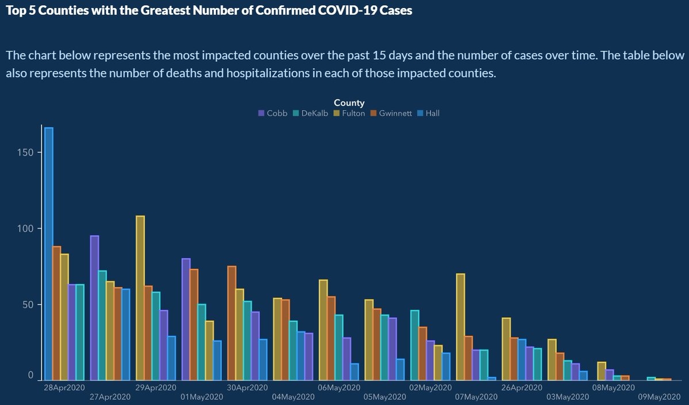

```{r child = "setup.Rmd"}
```

```{r echo=FALSE, message=FALSE, warning=FALSE}
library(tidyverse)
library(scales)
```

## Material 

`r emo::ji("movie_camera")` Watch [Misrepresentation](https://youtu.be/C_-rTKfswUI)

- [Slides](https://rstudio-education.github.io/datascience-box/course-materials/slides/u3-d01-misrepresentation/u3-d01-misrepresentation.html#1) 

`r emo::ji("movie_camera")` Watch [Data Privacy](https://youtu.be/c4fvdoNbcSw)

- [Slides](https://rstudio-education.github.io/datascience-box/course-materials/slides/u3-d02-privacy/u3-d02-privacy.html#1) 

`r emo::ji("movie_camera")` Watch [Algorithmic Bias](https://youtu.be/E2eD72pwtps)

- [Slides](https://rstudio-education.github.io/datascience-box/course-materials/slides/u3-d03-algorithmic-bias/u3-d03-algorithmic-bias.html#1) 

---

## Today's Goal 

- Understand data misrepresentation, data ethics, and algorithmic bias
- Critique visualizations and interpretations that misrepresent data or results of analysis
- Improve data visualizations to better convey the right message

---

## Quiz 

**Q - What confusion was there in this news article about interpreting the research results?**

```{r echo=FALSE, out.width = "100%"}
knitr::include_graphics("img/08/exercise-cancer-time.png")
```

---

## Quiz 

**Q - What confusion was there in this news article about interpreting the research results?**

- Original research

Moore, Steven C., et al. **["Association of leisure-time physical activity with risk of 26 types of cancer in 1.44 million adults."](https://jamanetwork.com/journals/jamainternalmedicine/fullarticle/2521826)** JAMA internal medicine 176.6 (2016): 816-825.

  - **Volunteers** were **asked** about their physical activity level over the preceding year. 
  - Compared to the bottom 10% of exercisers, the top 10% had lower rates of esophageal, liver, lung, endometrial, colon, and breast cancer.
  - No association was found between exercising and 13 other cancers (e.g. pancreatic, ovarian, and brain).

--

Causality vs. Association 

---

## Quiz 

**Q - What is wrong with this picture? How would you correct it?**

```{r echo=FALSE, out.width="73%", fig.align = "center"}

```

---

## Quiz 

**Q - What is wrong with this picture? How would you correct it?**

```{r echo=FALSE, fig.width = 5, fig.align = "center"}

```

- x-axis is sensible in time 
- order of counties is consistent 

---

## Quiz 

**Q - Which of these is a way to help visualize uncertainty in the results of a public opinion survey?**

.pull-left[
```{r catalan-misleading, echo=FALSE, warning=FALSE, out.width = "100%"}
catalan <- tibble(
  response = c("No", "Yes", "No answer"),
  rate     = c(45.3, 44.5, 10.2)
) %>%
  mutate(response = fct_relevel(response, "No", "Yes", "No answer"))

ggplot(catalan, aes(y = fct_rev(response), x = rate, color = response, group = response)) +
  geom_point() +
  geom_segment(aes(x = 0, xend = rate, 
                   y = fct_rev(response), yend = fct_rev(response)),
               size = 1) +
  scale_color_manual(values = c("#5C8AA9", "#9D303A", "gray")) +
  scale_x_continuous(labels = label_percent(scale = 1)) +
  guides(color = FALSE) +
  theme_minimal(base_size = 16) +
  labs(
    title = "Do you want Catalonia\nto become an independent state?",
    caption = "Margin of error: +/-2.95% at 95% confidence level",
    x = NULL, y = NULL
  )
```
]

.pull-right[
a. Resizing based upon population

b. Including margin of error bounds 

c. Including a causality discussion

d. Eliminate responses where the person surveyed has no opinion 
]
---

## Quiz 

**Q - Which of these is a way to help visualize uncertainty in the results a public opinion survey?**

.pull-left[
```{r catalan-misleading-fixed, echo=FALSE, warning=FALSE, out.width = "100%"}
catalan <- catalan %>%
  mutate(
    low = rate - 2.95,
    high = rate + 2.95
  )

ggplot(catalan, aes(y = fct_rev(response), x = rate, color = response, group = response)) +
  geom_segment(aes(x = low, xend = high, 
                   y = fct_rev(response), yend = fct_rev(response)),
               size = 0.8, color = "black") +
  geom_point(size = 3) +
  scale_color_manual(values = c("#5C8AA9", "#9D303A", "gray")) +
  scale_x_continuous(labels = label_percent(scale = 1)) +
  guides(color = FALSE) +
  theme_minimal(base_size = 16) +
  labs(
    title = "Do you want Catalonia\nto become an independent state?",
    caption = "The probability of the tiny difference between the\n'No' and 'Yes' being just due to random chance is very high.",
    x = NULL, y = NULL
  )
```
]

.pull-right[
a. Resizing based upon population

**b. Including margin of error bounds**

c. Including a causality discussion

d. Eliminate responses where the person surveyed has no opinion 
]

---

## Quiz 

**Q - The OK Cupid data breach didn’t release the real names and pictures of users. Was it ethical for researchers to release the users’ data? Why?**

a.	No, their identities could still be easily uncovered from the details 
provided such as usernames.

b.	No, OK Cupid users didn’t willingly give their data.

c.	Yes, if you don’t know the names it isn’t a problem.

d.	Yes, the data were already public.

---

## Quiz 

**Q - The OK Cupid data breach didn’t release the real names and pictures of users. Was it ethical for researchers to release the users’ data? Why?**

**a.	No, their identities could still be easily uncovered from the details 
provided such as usernames.**

b.	No, OK Cupid users didn’t willingly give their data.

c.	Yes, if you don’t know the names it isn’t a problem.

d.	Yes, the data were already public.

---

## Quiz 

**Q -	All algorithms are neutral and we should not worry about algorithmic bias.** (T/F)

--

F 

--

- gender-bias in Google translate and Amazon's hiring algorithm
- race-bias in facial recognition and criminal sentencing

---

## Guidelines for Discussion

- Listen respectfully. Listen actively and with an ear to understanding others’ views.

- Criticize ideas, not individuals.

- Commit to learning, not debating. Comment in order to share information, not to persuade.

- Avoid blame, speculation, and inflammatory language.

- Avoid assumptions about any member of the class or generalizations about social groups.

---

## Discussion

**What are the questions you should consider to avoid misrepresentation of data or results of data analysis?** 

```{r echo = F}
countdown::countdown(minutes = 3, seconds = 0)
```
--

- Is it association or causality? 
- Can I generalize the result to a bigger group? 
- Are the scales correct and not distorted? 
- Are the axes in intuitive and natural order? 
- Do size / areas align well with associated figures? 
- For estimates, how uncertain are they? 

---

## Discussion

**What is data ethics?**

```{r echo = F}
countdown::countdown(minutes = 3, seconds = 0)
```

--
.pull-left[
- Ethics related to data practices, including, but not limited to, 
generation, collection, analysis, and dissemination of data 
- Ask yourself all the time to not violate reasonable expectations of privacy and ethical practices as a researcher 
    - "Should I?"
    - "Is it necessary / reasonable?"
    - "Is it okay that somebody does the same to me and the data about me?"
] 

.pull-right[

<iframe src="https://giphy.com/embed/MCZ39lz83o5lC" width="480" height="257" frameBorder="0" class="giphy-embed" allowFullScreen></iframe><p><a href="https://giphy.com/gifs/MCZ39lz83o5lC">via GIPHY</a></p>

]


---

## Discussion

**As you start working on data analyses for the STA199 project, internships, research, etc., what are 1 - 2 things you can do to ensure you’re doing the analysis in an ethical way?**

```{r echo = F}
countdown::countdown(minutes = 3, seconds = 0)
```
--

- Be familiar with research ethics, compliance, protocols, etc.


---

class: middle, center

# Questions?


---

## Let's Practice Together! 

Go to [AE 08: Data Science Ethics](https://sta199-summer22.netlify.app/appex/ae08_BJ.html)

---

## Bulletin

- Lab 03 due today at 11:59pm

- HW 01 due Tuesday, May 24 at 11:59pm

- Submit your `ae08`


