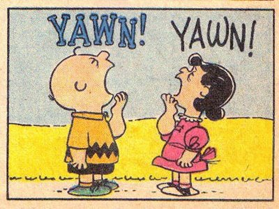

```{r child = "setup.Rmd"}
```

```{r packages, echo=FALSE, message=FALSE, warning=FALSE}
library(tidyverse)
library(tidymodels)
library(openintro)
```

## Today's Goal 

- Conduct simulation-based hypothesis testing for independence 
- Practice the three `generate` options: `permute`, `draw`, and `bootstrap`

---

class: middle, center

# Testing for Independence

---

## Is Yawning Contagious?

.pull-left[

]
.pull-right[

]

An experiment conducted by the MythBusters tested if a person can be subconsciously influenced into yawning if another person near them yawns.

---

## Study Description

In this study 50 people were randomly assigned to two groups: 34 to a group where a person near them yawned (treatment; trmt) and 16 to a control group where they didn't see someone yawn (control; ctrl).

The data `yawn` are in the `openintro` package.

```{r}
glimpse(yawn)
```

---

## Proportion of Yawners

```{r}
yawn %>%
  count(group, result) %>%
  group_by(group) %>%
  mutate(p_hat = n / sum(n))
```

- Proportion of yawners in the treatment group: $\frac{10}{34} = 0.2941$
- Proportion of yawners in the control group: $\frac{4}{16} = 0.25$
- Difference: $0.2941 - 0.25 = 0.0441$

---

## Independence?

Based on the proportions we calculated, do you think yawning is really contagious, i.e. are seeing someone yawn and yawning dependent?

```{r echo=FALSE}
yawn %>%
  count(group, result) %>%
  group_by(group) %>%
  mutate(p_hat = n / sum(n)) %>% 
  knitr::kable(digits = 3)
```

Well, the Mythbusters claimed that the difference in proportion of yawners between the two groups (0.044) was significant, based on intuition. Do you buy this?

---

## Possible Explanations?

--

- The observed differences might suggest that yawning is contagious, i.e. seeing someone yawn and yawning are **dependent**.

--

- But the differences are small enough that we might wonder if they might be simply **due to chance**.

--

- Let's see what hypothesis testing says using simulations! 

---

## 1. Defining hypotheses

$H_0:$ 

--

- Yawning is not contagious.
- Yawning and seeing someone yawn are **independent**. 
- The observed difference in proportions is simply due to chance. 
- $p_{trmt} = p_{ctrl}$ $\Leftrightarrow$ $p_{trmt} - p_{ctrl} = 0$

--

$H_1:$ 

--

- Yawning is contagious.
- Yawning and seeing someone yawn are **dependent**. 
- The observed difference in proportions is not due to chance. 
- $p_{trmt} > p_{ctrl}$ $\Leftrightarrow$ $p_{trmt} - p_{ctrl} > 0$

.small[
$p_{trmt}$: the true proportion of yawners among those who see someone yawn <br>
$p_{ctrl}$: the true proportion of yawners among those who don't see someone yawn.
]

---

## 2. Summarizing Data

```{r}
p_hat_diff <- yawn %>%
  count(group, result) %>%
  group_by(group) %>%
  mutate(p_hat = n / sum(n)) %>% 
  filter(result == "yawn") %>% 
  pull(p_hat) %>% 
  diff()
p_hat_diff
```

---

## 3. Assessing Observed Evidence

### 3-1. Null Distribution 

We know from our observed data that 

- 14 people yawned and 36 people didn't yawn
- 16 people were assigned in the control group and 34 people in the treatment group (saw someone yawn). 

If the null hypothesis is true, 14 people who yawned should still be a yawner and 36 people who didn't yawn shouldn't be a yawner regardless of their assignment to the treatment vs. control group. 

---

## 3. Assessing Observed Evidence

### 3-1. Null Distribution 

Therefore, we will **shuffle** the group assignment for 14 yawners and 36 non-yawners and calculate the difference in proportions of yawners in each group, $\hat{p}_{trmt} - \hat{p}_{ctrl}$. 

We repeat the shuffling-calculation over and over again and approximate the distribution of the difference in sample proportions under the null. 

Unlike bootstrapping, here we sample **without replacement**; we merely permute / shuffle the treatment labels of each subject in the data. 

---

## 3-1. Null Distribution 

Let's simulate the null distribution with functions in the `infer` package. 

```{r}
set.seed(602)

null_dist <- yawn %>%
  specify(response = result, explanatory = group, success = "yawn") %>%
  hypothesize(null = "independence") %>%
  generate(reps = 1000, type = "permute") %>%
  calculate(stat = "diff in props", order = c("trmt", "ctrl"))
```

---

## 3-1. Null Distribution 

### `specify`

.small[
- Start with the data frame
- **Specify the variables**
    - **Since the response variable is categorical, specify the level which should be considered as "success"**

```{r eval=FALSE}
yawn %>%
{{  specify(response = result, explanatory = group, success = "yawn") }}
```
]

---

## 3-1. Null Distribution 

### `hypothesize`

.small[
- Start with the data frame
- Specify the variables
    - Since the response variable is categorical, specify the level which should be considered as "success"
- **State the null hypothesis (yawning and whether or not you see someone yawn are independent)**

```{r eval=FALSE}
yawn %>%
  specify(response = result, explanatory = group, success = "yawn") %>%
{{ hypothesize(null = "independence") }}
```
]

---

## 3-1. Null Distribution 

### `generate`

.small[
- Start with the data frame
- Specify the variables
    - Since the response variable is categorical, specify the level which should be considered as "success"
- State the null hypothesis (yawning and whether or not you see someone yawn are independent)
- **Generate 1,000 simulated differences via permutation / shuffling**

```{r eval=FALSE}
yawn %>%
  specify(response = result, explanatory = group, success = "yawn") %>%
  hypothesize(null = "independence") %>%
{{ generate(reps = 1000, type = "permute") }}
```
]

---

## 3-1. Null Distribution 

### `calculate`

.small[
- Start with the data frame
- Specify the variables
    - Since the response variable is categorical, specify the level which should be considered as "success"
- State the null hypothesis (yawning and whether or not you see someone yawn are independent)
- Generate 1,000 simulated differences via permutation / shuffling
- **Calculate the sample statistic of interest (difference in proportions)**
    - **Since the explanatory variable is categorical, specify the order in which the subtraction should occur for the calculation of the sample statistic, $(\hat{p}_{trmt} - \hat{p}_{ctrl})$.**

```{r eval=FALSE}
yawn %>%
  specify(response = result, explanatory = group, success = "yawn") %>%
  hypothesize(null = "independence") %>%
  generate(reps = 1000, type = "permute") %>%
{{ calculate(stat = "diff in props", order = c("trmt", "ctrl")) }}
```
]

---

## 3-1. Null Distribution 

### `<-`

.small[
- **Save the result**
- Start with the data frame
- Specify the variables
    - Since the response variable is categorical, specify the level which should be considered as "success"
- State the null hypothesis (yawning and whether or not you see someone yawn are independent)
- Generate 1,000 simulated differences via permutation / shuffling
- Calculate the sample statistic of interest (difference in proportions)
    - Since the explanatory variable is categorical, specify the order in which the subtraction should occur for the calculation of the sample statistic, $(\hat{p}_{trmt} - \hat{p}_{ctrl})$.
    
```{r eval=FALSE}
{{null_dist <- yawn %>% }}
  specify(response = outcome, explanatory = group, success = "yawn") %>%
  hypothesize(null = "independence") %>%
  generate(reps = 1000, type = "permute") %>%
  calculate(stat = "diff in props", order = c("treatment", "control"))
```
]

---

## 3-1. Null Distribution 

### `visualize`

**Q - What would you expect the center of the null distribution to be?**

--
.small[
```{r eval = FALSE}
visualize(null_dist) + 
  labs(x = "Difference in sample proportions", y = "Count")
```
]

```{r echo = FALSE, out.width="50%"}
visualize(null_dist) +
  labs(x = "Difference in sample proportions", y = "Count")
```

---

## 3. Assessing Observed Evidence

### 3-2. p-value

**Q - Find the p-value.** 

In what % of the simulations was the simulated difference in sample proportion 
at least as extreme as the observed difference in sample proportions?

---

## 3-2. p-value

**Q - Find the p-value.** 

```{r out.width="50%"}
visualize(null_dist) +
  labs(x = "Difference in sample proportions", y = "Count") +
{{ shade_pvalue(obs_stat = p_hat_diff, direction = "greater") }}
```

---

## 3-2. p-value

**Q - Find the p-value.** 

```{r}
null_dist %>%
  filter(stat >= 0.0441) %>%
  summarize(p_value = n()/nrow(null_dist))


pvalue <- null_dist %>% 
  get_pvalue(obs_stat = p_hat_diff, direction = "greater")
pvalue
```

---

## 4. Making a conclusion

**Q - What is the conclusion of the hypothesis test at** $\alpha = 0.05$?

--

The p-value of `r pvalue` is larger than $\alpha = 0.05$, so we fail to reject the null.
The data do not provide convincing evidence that the true proportion of yawners among those who see someone yawn is significantly larger than the proportion of yawners among those who don't see someone yawn. 

---

class: middle, center

# Questions?

---

## Let's Practice Together! 

Go to [AE 16: Hypothesis Testing 2](https://sta199-summer22.netlify.app/appex/ae16_BJ.html)

---

## Bulletin

- Watch videos for [Prepare: June 6](https://sta199-summer22.netlify.app/prepare/week05_jun06_BJ.html)

- Mid-course evaluation due tonight at 11:59pm 

- Project proposal due tonight at 11:59pm 

- HW03 due Wednesday, June 8 at 11:59pm  

- Submit `ae15` (Rent in Manhattan and Practice) and `ae16` 


