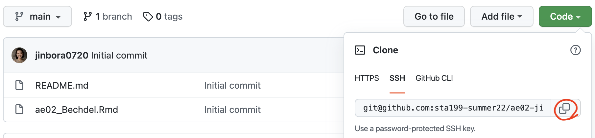
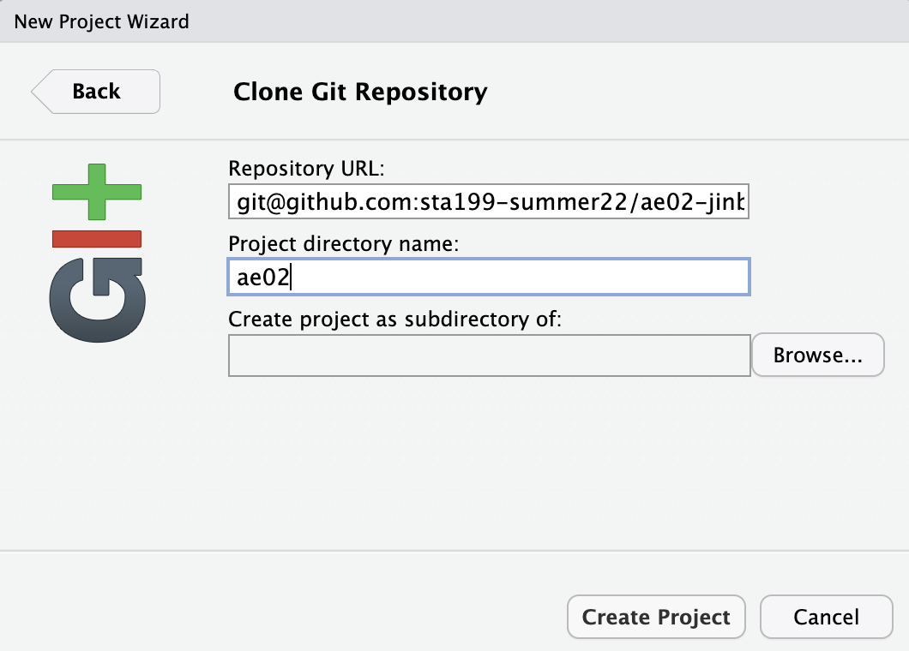

# Tour of R and RStudio 

- Open RStudio: [https://vm-manage.oit.duke.edu/containers](https://vm-manage.oit.duke.edu/containers)
- Tour of RStudio interface 
  - Console
  - Environment 
  - Help 
  
## R basics

We can use `R` as a calculator by typing the following in "Console":

```{r eval = FALSE}
3 * 5 + 10
```

```{r eval = FALSE}
x <- 3
x + x^2
```

For more complex analyses, we need to know definitions of common terms: 

- A **variable** is a container for storing data. 
`<-` and `=` are known as "assignment operators" and they save a value (or collection of values) as a **variable**.

```{r ex-variable}
y <- 2
x = 1:10
```

When you type the name of an object into the console, it prints to the screen. The variables can also be found in "Environment".

```{r ex-print-to-screen}
x
```

- A **function** is literally just a bunch of instructions. Most often, we will work with functions that take input (also called **arguments**) and return an output.

```{r ex-function}
mean(x)
```

`mean()` is a function that takes a numeric input and returns the mean of that input. All functions in `R` have `()` and inside those parentheses is where inputs (aka "arguments") go.

- A **package** (also called a **library**) is a collection of functions and/or data. 

```{r ex-package, message=FALSE}
library(fivethirtyeight)
```

- **Data frames** are lists of variables. Typically the columns are called "variables", while the rows are thought of as "observations". `bechdel` is a data frame in `fivethirtyeight` package. 

```{r ex-data, eval = FALSE}
bechdel
```
- Let's check the help documentation of `bechdel`. 
```{r ex-help, eval=F}
?bechdel
```

# Tour of GitHub 

## Getting Started

### Configuring SSH and GitHub

Until recently, you could use a user name and password to log into GitHub.
GitHub has deprecated using a password in that way.
Instead, we will be authenticating GitHub using public/private based keys.
This is a short overview for how to authenticate in this way.

1.  First, type `credentials::ssh_setup_github()` into your console.
2.  R will ask "No SSH key found. Generate one now?" You should click 1 for yes.
3.  You will generate a key. It will begin with "ssh-rsa...." R will then ask "Would you like to open a browser now?" You should click 1 for yes.
4.  You may be asked to provide your username and password to log into GitHub. This would be the ones associated with your account that you set up. After entering this information, you should paste the key in and give it a name.

### Configure git

We need to configure git so that RStudio can communicate with GitHub.
This requires two pieces of information: your name and the email address associated with your GitHub account.

To do so, you will use the **terminal**, which you can find right next to the console.

```{r use-this, eval=FALSE}
git config --global user.name 'username'
git config --global user.email 'useremail'
```

For example, mine would be

```{r name, eval=FALSE}
git config --global user.name 'jinbora0720'
git config --global user.email 'bora.jin@duke.edu'
```

*Note: you should not have to do this every time.*

## Clone the Repo & Start New RStudio Project

1. Visit [course GitHub organization page](https://github.com/sta199-summer22) and accept the invite to join the course. 
2. Select the repository entitled "ae02-GitHubUsername"
3. Click on the green **Code** button, select **SSH** (this might already be selected by default, and if it is, you'll see the text **Clone with SSH**). Click on the clipboard icon to copy the repo URL.

```{r copyssh, echo=FALSE, fig.align='center', out.width = '100%'} 

``` 

4. In your RStudio, go to *File* $\rightarrow$ *New Project* $\rightarrow$ *Version Control* $\rightarrow$ *Git*.
5. Copy and paste the URL of your assignment repo into the dialog box *Repository URL*. Again, please make sure to have *SSH* highlighted under *Clone* when you copy the address.

```{r clonegit, echo=FALSE, fig.align='center', out.width = '60%'} 

``` 

6. Click *Create Project*, and the files from your GitHub repo will be displayed in the *Files* pane in RStudio.
7. Click `ae02_Bechdel.Rmd` to open the template R Markdown file.
  
# Bechdel

- Put your name for the author, the knit the document. 
- Select all of the updated files in the Git pane, click to commit and write the commit message "Update author name".
- Click to push your changes. 
- Refresh your repo on GitHub and see if the files are correctly updated with your commit message. 
- Follow along with the instructions in `ae02_Bechdel.Rmd`. 

# Additional Resources

- https://raw.githubusercontent.com/rstudio/cheatsheets/master/rmarkdown-2.0.pdf
- https://www.tidyverse.org/
- https://happygitwithr.com/
- https://style.tidyverse.org/ 
