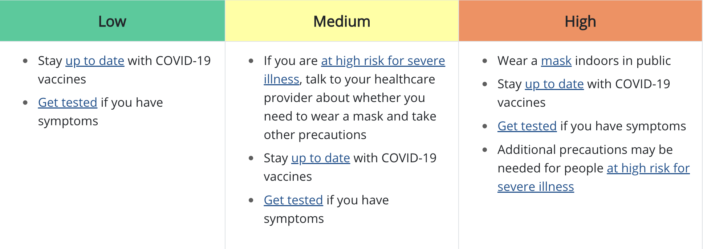

## Getting Started 

- Go to the [course GitHub organization page](https://github.com/sta199-summer22) and find the repository entitled "ae07-GitHubUsername".
- Click the green "code" button and copy the `SSH` URL.
- Go to [RStudio](https://vm-manage.oit.duke.edu/containers), select `File` $\rightarrow$ `New Project` $\rightarrow$ `Version Control` $\rightarrow$ `Git` and paste the URL.
- Open the `.Rmd` file and replace "Your Name" with your name. 

## Covid-19 Community Level 

*The following paragraph and figure directly come from the [website](https://www.cdc.gov/coronavirus/2019-ncov/your-health/covid-by-county.html) of Centers for Disease Control and Prevention (CDC)*:

COVID-19 Community Levels are a new tool to help communities decide what prevention steps to take based on the latest data. Levels can be low, medium, or high and are determined by looking at hospital beds being used, hospital admissions, and the total number of new COVID-19 cases in an area. 
```{r covid-level, echo=FALSE, fig.align='center', out.width = '100%'} 

``` 

We will investigate how Covid-19 community levels have changed across US counties since the first data release on Feb 24, 2022. The data are weekly updated, and we use data slightly modified from the version updated on May 5, 2022. Click [here](https://data.cdc.gov/Public-Health-Surveillance/United-States-COVID-19-Community-Levels-by-County/3nnm-4jni) if you are interested in raw data. 

We first load relevant packages:

```{r load-packages, message = FALSE}
library(tidyverse)
library(sf)
```

### Part 1: Spatial Data are Different

We load Covid-19 community level data in a csv file. This is our typical "tidy" data frame. 

```{r load-covid, message = FALSE}
covid <- read_csv("data/covid.csv") 
covid
```

We use `filter` and `select` to focus on the contiguous US and the following variables: 

|variable name | description |
|:----------|:--------|
| `state` |  State name |
| `county` |  County name |
| `county_fips` | Federal Information Processing Standards (FIPS) five character county code |
| `county_population` |  County population (2019 Census estimate) |
| `covid_community_level` | Covid-19 community level |
| `date` | Date of data release |

```{r load-covid-2, message = FALSE}
covid <- covid %>% 
  filter(!(state %in% c("United States Virgin Islands", 
                        "Commonwealth of the Northern Mariana Islands", 
                        "American Samoa",
                        "Puerto Rico", 
                        "Alaska", 
                        "Hawaii", 
                        "Guam"))) %>% 
  select(state, county, county_fips, county_population, 
         covid_community_level, date)
```

In order to draw maps based on Covid-19 community level, we need another data set that has information on **geometry** of US counties. 
We read the shapefile `us_counties.shp` using `st_read()`. Its original shapefile (.shp) is downloadable from the [US Census Bureau](https://www.census.gov/geographies/mapping-files/time-series/geo/carto-boundary-file.html) under "cb_2018_us_county_20m.zip" (resolution level 1:20,000,000). 

The loaded data frame has the following variables:

|variable name | description |
|:----------|:--------|
| `statefips` | State FIPS |
| `countyfips` |  County FIPS |
| `county` | County name |
| `geometry` | geometry features |

This is an `sf` object. 

```{r load-counties}
us_counties <- st_read("data/us_counties.shp", quiet = TRUE)
us_counties
```

**Q - ** What differences do you observe when comparing a typical tidy
data frame to the new simple feature object?

### Part 2: `sf` and `dplyr`

The `sf` package plays nicely with our earlier data wrangling functions from `dplyr`.

#### `filter()`

Compare county FIPS from two data sets by filtering for Durham county in NC. The state FIPS for NC is 37. Check variable names, types, and value formats before filtering. 

```{r filter, eval = FALSE}
us_counties %>% 
  filter(____, ____) 

covid %>% 
  filter(____, ____) 
```

**Q - **How are they different?

#### `mutate()`

In `us_counties` data, we will create a new variable `county_fips` that exactly matches `county_fips` from `covid` data. Here we use `paste0()` to concatenate strings. 

```{r mutate}
us_counties <- us_counties %>% 
  mutate(county_fips = paste0(statefips, countyfips))
```

#### `select()`

Let's check if `county_fips` is well created as we intended by selecting `statefips`, `countyfips`, and `county_fips` from `us_counties`. 

```{r select}
us_counties %>% 
  select(statefips, countyfips, county_fips)
```

Notice that geometries are "sticky". They are kept until deliberately dropped using 
`st_drop_geometry`. Manipulating spatial data objects is similar, but not identical to
manipulating data frames. 

```{r drop-geometry}
us_counties %>% 
  select(county, county_fips) %>% 
  st_drop_geometry() %>% 
  slice(1:5)
```

#### `something_join()`

Create a new `sf` object `covid_sf` by joining `covid` and `us_counties` keeping all rows in `covid`. Note that two variable names are common, namely, `county_fips` and `county`, in both data frames. 

```{r before-join}
glimpse(covid)
glimpse(us_counties)
```

**Q - **Which variable should we use to join the data frames by? Can we use any? Why or why not? 

```{r join}
covid_sf <- covid %>% 
  left_join(us_counties, by = "county_fips") %>% # tbl_df/ tbl/ data.frame, no sf!
  st_as_sf()
covid_sf
```

**Q - **Check what happens to the common variable that is not used in joining. 

#### `group_by()`, `summarize()`

Using `covid`, let's compute the total population living in counties with each of the Covid-19 community levels based on the latest data (`date == "2022-05-05"`). Complete the code chunk below.

```{r summarize, eval = FALSE}
covid %>% 
  filter(date == "2022-05-05") %>% 
```

### Part 3: `sf` and `ggplot`

We will examine how the Covid-19 community levels change over space and over time. 
As usual, we can build up a visualization layer-by-layer beginning with `ggplot`. 
Let's start by making a basic plot of all US counties.

```{r plot-us, fig.width=10, fig.height=6}
covid_sf %>% 
  ggplot() + 
  geom_sf() + 
  labs(title = "US counties")
```

Let's try NC.

```{r plot-nc, fig.width=10, fig.height=4, eval = FALSE}
covid_sf %>% 
  filter(state == "_____") %>% 
  ggplot() + 
  geom_xxxx() + 
  labs(title = "NC counties")
```

Now adjust the theme with `theme_bw()`.

```{r plot-theme, fig.width=10, fig.height=4, eval = FALSE}
covid_sf %>% 
  filter(state == "_____") %>% 
  ggplot() + 
  geom_xxxx() + 
  labs(title = "NC counties") +
  theme_bw() # white canvas
```

If you liked the theme, we can globally fix it as a default theme instead of attaching that layer for every ggplot. 

```{r theme-global}
theme_set(theme_bw())
```

We now fill each county by the latest value of Covid-19 community level (`date == "2022-05-05"`). To match colors used in CDC, we use `scale_fill_manual()`. 

```{r plot-covid-us, fig.width=10, fig.height=6, eval = FALSE}
covid_sf %>% 
  ______(date == "2022-05-05") %>% 
  ggplot() + 
  geom_sf(aes(fill = _______)) + 
  labs(title = "Covid-19 community level across US counties as of May 5, 2022", 
       fill = "Covid-19 community level") +
  scale_fill_manual(values = c("High" = "#fb8b5b",
                               "Medium" = "#f9f99d", 
                               "Low" = "#00cc99"))
```

Now adjust `color` in `geom_sf` to change the color of the county borders.

```{r plot-covid-us-2, fig.width=10, fig.height=6, eval = FALSE}
covid_sf %>% 
  filter(date == "2022-05-05") %>% 
  ggplot() + 
  geom_sf(aes(fill = covid_community_level), # mapping
          _________) + # setting
  labs(title = "Covid-19 community level across US counties as of May 5, 2022", 
       fill = "Covid-19 community level") +
  scale_fill_manual(values = c("High" = "#fb8b5b",
                               "Medium" = "#f9f99d", 
                               "Low" = "#00cc99"))
```

Adjust the width of the county borders using `size`.

```{r plot-covid-us-3, fig.width=10, fig.height=6, eval = FALSE}
covid_sf %>% 
  filter(date == "2022-05-05") %>% 
  ggplot() + 
  geom_sf(aes(fill = covid_community_level), # mapping
          _________) + # setting
  labs(title = "Covid-19 community level across US counties as of May 5, 2022", 
       fill = "Covid-19 community level") +
  scale_fill_manual(values = c("High" = "#fb8b5b",
                               "Medium" = "#f9f99d", 
                               "Low" = "#00cc99"))
```

Finally, adjust the transparency using `alpha` by mapping 

```{r plot-covid-us-4, fig.width=10, fig.height=6, eval = FALSE}
covid_sf %>% 
  filter(date == "2022-05-05") %>% 
  ggplot() + 
  geom_sf(aes(fill = covid_community_level), # mapping
          _________) + # setting
  labs(title = "Covid-19 community level across US counties as of May 5, 2022", 
       fill = "Covid-19 community level") +
  scale_fill_manual(values = c("High" = "#fb8b5b",
                               "Medium" = "#f9f99d", 
                               "Low" = "#00cc99"))
```

**Q - **What is your final choice of `color`, `size`, and `alpha`? 

```{r plot-covid-us-final, fig.width=10, fig.height=6}
# code here 
```

**Q - **Create the same plot for NC counties only. Different choices of `color`, `size`, and `alpha` might be more appealing in this case. 

```{r plot-covid-nc-final, fig.width=10, fig.height=4}
# code here 
```

**Q - ** What is the county that has a different community level than the rest of the counties in NC? 
```{r find-medium}
# code here 
```

We can visualize temporal trends of Covid-19 community levels by faceting. 

**Q - **Create a faceted plot of US counties over all available dates where each county is filled with Covid-19 community level. Briefly explain the spatial and temporal trends. 

```{r plot-covid-us-facet, out.width="100%"}
# code here 
```

**Q - **Repeat the previous exercise for states of your choosing. 

```{r plot-covid-facet, out.width="100%"}
# code here 
```

## Practice

(1) Write a brief research question that you could answer with this dataset and then investigate it here.

```{r practice-1}
# code here 
```

(2) What are limitations of your visualizations above?

## Submitting Application Exercises

- Once you have completed the activity, push your final changes to your GitHub repo. 
- Make sure you committed at least *three* times. 
- Check that your repo is updated on GitHub, and that’s all you need to do to submit application exercises for participation.

### Additional Resources

- [Simple features in `R`](https://r-spatial.github.io/sf/)
- [Coordinate references systems](https://www.nceas.ucsb.edu/sites/default/files/2020-04/OverviewCoordinateReferenceSystems.pdf)
- [Geographic data in `R`](https://geocompr.robinlovelace.net/spatial-class.html)