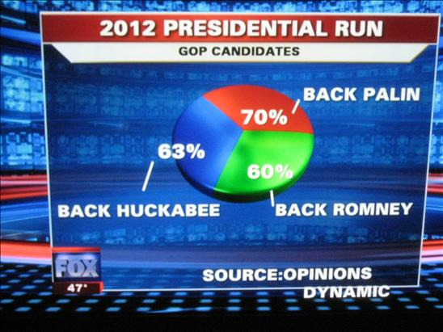
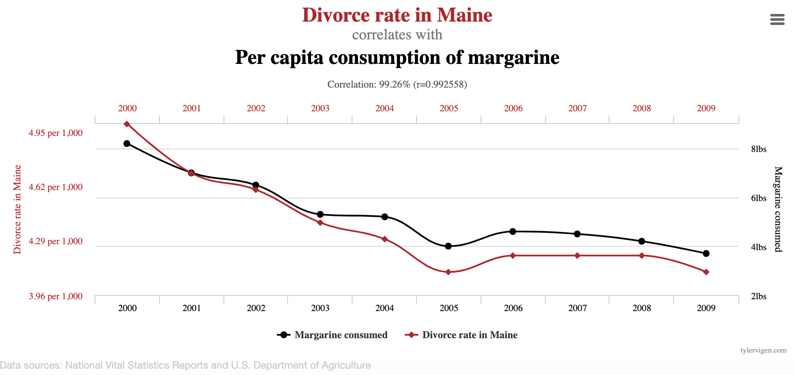
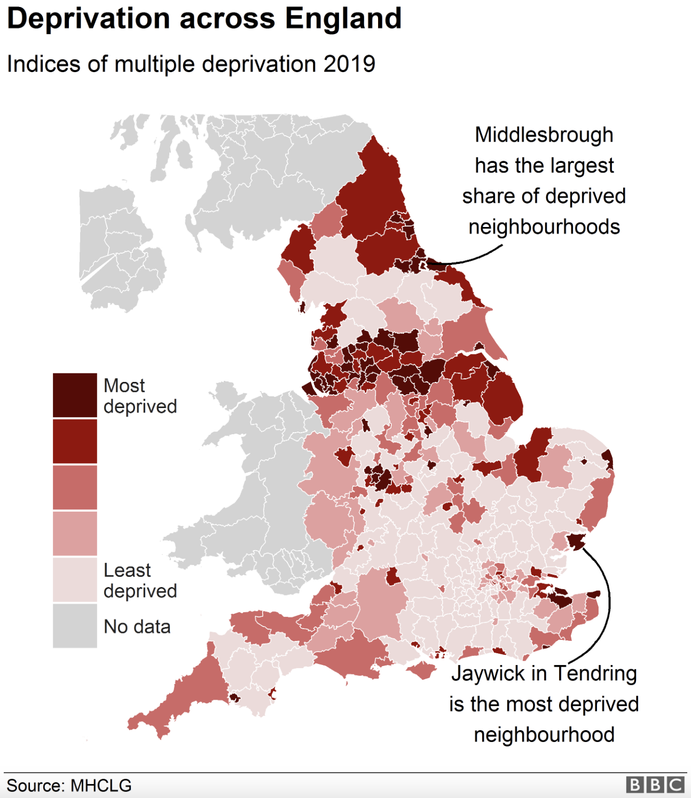
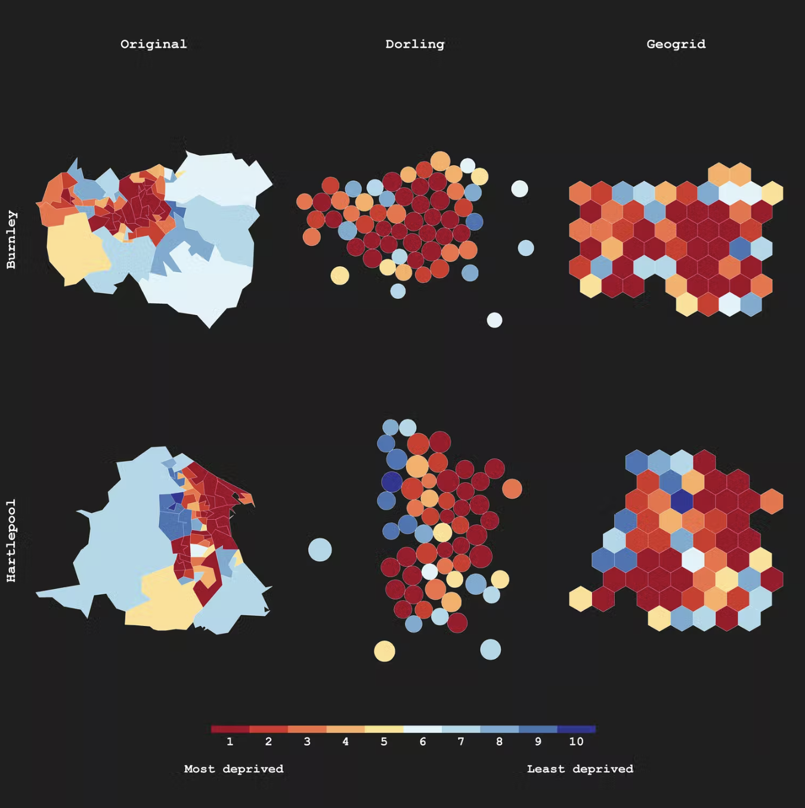

## Getting Started 

- Go to the [course GitHub organization page](https://github.com/sta199-summer22) and find the repository entitled "ae08-GitHubUsername".
- Click the green "code" button and copy the `SSH` URL.
- Go to [RStudio](https://vm-manage.oit.duke.edu/containers), select `File` $\rightarrow$ `New Project` $\rightarrow$ `Version Control` $\rightarrow$ `Git` and paste the URL.
- Open the `.Rmd` file and replace "Your Name" with your name. 

## Data Representation

### Part 1: Misleading Pie Charts^[Source: http://flowingdata.com/2009/11/26/fox-news-makes-the-best-pie-chart-ever/]

```{r echo=FALSE, out.width = "80%", fig.align='center'}

```

**Q - ** What is the graph trying to show?

**Q - ** Why is this graph misleading?

### Part 2: Spurious Correlations^[Source: https://www.tylervigen.com/spurious-correlations Content warning: some examples include death or suicide.] 

```{r echo=FALSE, out.width = "100%", fig.align='center'}

```

**Q - ** What is the graph trying to show?

**Q - ** Why is this graph misleading?

**Q - ** Try fixing or improving the graph with the given data below. The unit of `value` for `what` = "Divorce rate" is per 1,000, and it is lbs for `what` = "margarine". What message is more clear in your visualization than it was in the original visualization? Hint: compare relative change (new-old)/old from 2000 to remove the effects of different scales. 

```{r package, message = FALSE}
library(tidyverse)
```

```{r d-m-data}
df <- tribble(
  ~value, ~year, ~what, 
  5, 2000, "Divorce rate",
  4.7, 2001, "Divorce rate",
  4.6, 2002, "Divorce rate",
  4.4, 2003, "Divorce rate",
  4.3, 2004, "Divorce rate",
  4.1, 2005, "Divorce rate",
  4.2, 2006, "Divorce rate",
  4.2, 2007, "Divorce rate",
  4.2, 2008, "Divorce rate",
  4.1, 2009, "Divorce rate",
  8.2, 2000, "Per capita consumption of margarine",
  7, 2001, "Per capita consumption of margarine",
  6.5, 2002, "Per capita consumption of margarine",
  5.3, 2003, "Per capita consumption of margarine",
  5.2, 2004, "Per capita consumption of margarine",
  4, 2005, "Per capita consumption of margarine",
  4.6, 2006, "Per capita consumption of margarine",
  4.5, 2007, "Per capita consumption of margarine",
  4.2, 2008, "Per capita consumption of margarine",
  3.7, 2009, "Per capita consumption of margarine"
)
``` 

```{r d-m-vis, eval = FALSE}
df %>% 
  mutate(starting_value = rep(c(5, 8.2), each = 10)) %>% 
  mutate(rc_value = (value - _____)/_____) %>% 
  ggplot(aes(x = ____, y = ____, col = ____)) + 
  geom_line() + 
  geom_point() +
  labs(x = "Year", y = "Relative change from 2000", 
       color = "Variable") +
  scale_x_continuous(breaks = 2000:2009) +
  scale_color_viridis_d() +
  theme(legend.position = "bottom")
```

### Part 3: Misleading Truth^[Source: https://theconversation.com/even-the-most-beautiful-maps-can-be-misleading-126474]

Sometimes, a completely honest, but not well-thought-out graph can distort the information that the visualization intends to show. 

```{r echo=FALSE, out.width = "60%", fig.align='center'}

```

**Q - ** What is the graph trying to show?

**Q - ** Why is this graph misleading?

*"In general, highly deprived neighborhoods such as urban areas tend to be densely populated, 
and they are less visible on a regular map. By contrast, wealthier suburban areas – which are often less densely populated and therefore much larger – dominate the map. So there’s a risk that readers might draw inaccurate conclusions about the level of deprivation in any given area."* 

Therefore, we may consider non-traditional maps such as hexagonal geogrids scaled by resident population to give readers a more accurate impression.

```{r echo=FALSE, out.width = "80%", fig.align='center'}

```

### Part 4: Algorithmic Bias and Simpson's Paradox 

- `r emo::ji("movie_camera")` [Video](https://warpwire.duke.edu/w/_3YEAA/) and  [Slides](https://sta199-fa20-002.netlify.app/appex/STA_199_Data_Science_Ethics_Deep_Dive.pdf)

A company uses a machine learning algorithm to determine which job advertisement to display for users searching for technology jobs. Based on past results, the algorithm tends to display lower paying jobs for women than for men (after controlling for other characteristics than gender).^[Source: Modern Data Science with R, 2nd Edition] 

**Q - ** What ethical considerations might be considered when reviewing this algorithm?

**Simpson's paradox** is a phenomenon where conclusions drawn from analyzing subgroups differ from conclusions drawn from the aggregate group. We will demonstrate Simpson's paradox with the data below. ^[Source:  https://www.randomservices.org/random/data/Berkeley.html]

```{r sp, message=F}
berk <- read_csv("data/Berkeley_admissions.csv")
```

**Q -** Let's compute total female / male applicants, the total number of 
applicants accepted, and acceptance probabilities for female / male / all applicants.


**Q -** So what happened at Berkeley?


## Data Ethics 

### Part 5: Ethics in Collecting & Handling Data 

A data analyst received permission to post a dataset that was scraped from a social media site. The full dataset included name, username, email address, geographic location, IP (Internet protocol) address, demographic profiles, and preferences for relationships. The analyst removes name and email address from the data set in effort to de-identify it.

**Q - ** Why might it be problematic to post this dataset publicly?

**Q - ** You want to make the data available so your analysis is transparent and reproducible. How can you modify the full dataset to make the data available in an ethical way?

## Submitting Application Exercises

- Once you have completed the activity, push your final changes to your GitHub repo. 
- Make sure you committed at least *three* times. 
- Check that your repo is updated on GitHub, and that’s all you need to do to submit application exercises for participation.


