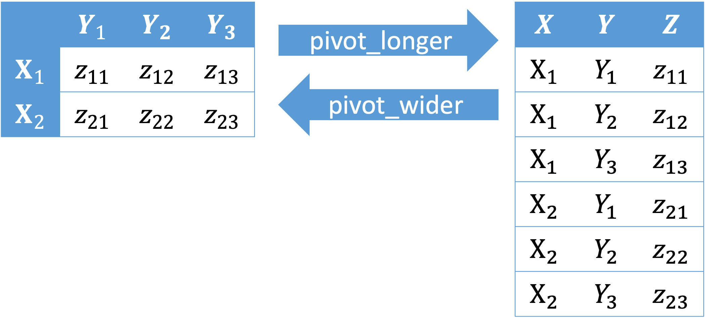

## Package

```{r load-package, message = FALSE}
library(tidyverse)
```

## Part 1: Pivoting 



- `pivot_longer()` "lengthens" data, increasing the number of rows and 
decreasing the number of columns.

```{r, eval = FALSE}
data_left %>% 
  pivot_longer(col = Y1:Y3, 
               names_to = "Y", 
               values_to = "Z")
```

- `pivot_wider()` "widens" data, increasing the number of columns and decreasing 
the number of rows.

```{r, eval = FALSE}
data_right %>% 
  pivot_wider(names_from = Y, 
              values_from = Z)
```

### Practice^[Source: https://tidyr.tidyverse.org/reference/pivot_wider.html, https://tidyr.tidyverse.org/reference/pivot_longer.html]

(1) Transform the dataset `relig_income` to one with columns `religion`, `income`, and `count` using either `pivot_wider()` or `pivot_longer()`.

```{r}
relig_income %>% 
  head()
```

(2) Transform the dataset `fish_encounters` to one with a matrix structure where 
rows indicate fish, columns indicate station, and each cell indicates whether each 
fish was seen in a certain station (1 if yes and 0 otherwise). Use either 
`pivot_wider()` or `pivot_longer()`.

```{r}
fish_encounters %>% 
  head()
```

(3) Transform the dataset `billboard` to one with columns `artist`, `track`, 
`data.entered`, `week`, and `rank`. Drop `NA` values for `rank`. Use `pivot_wider()` or `pivot_longer()`.
 
```{r}
billboard %>% 
  head()
```

## Part 2: Probability

Try exercises [here](https://sta199-sp22-003.netlify.app/hw/hw03.html) and ask me questions. 

## Part 3: Inference based on Simulations or Central Limit Theorem

Try questions [here](https://sta199-summer2021.github.io/website/hw/hw-02.html) 
and ask me questions. 

## Submitting Application Exercises

- No need to submit anything 

