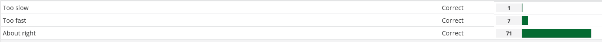
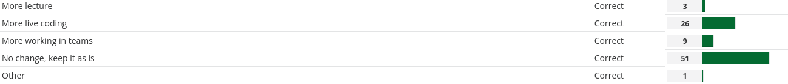

### The pace of the course is...
{width=100%}

### How have you learned the best so far in the class?
{width=100%}


### Do you have suggestions for how the lecture time should be split between different activities?
{width=100%}

### How many hours per week do you spend working on this class?

```{r hours-per-week, message=F, echo=F}
library(tidyverse)
feedback = read_csv("data/mid_feedback.csv")
feedback %>%
  ggplot(aes(x = hours_per_week)) + 
  geom_histogram(bins = 14) +
  theme_bw()
```


### Additional notes...

- more clear tidyverse style guidelines: [FAQ](https://sta199-sp22-003.netlify.app/faq/faq.html)
- `join` confusion
- ae hover
