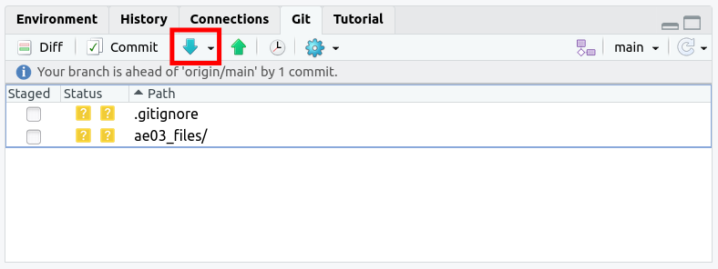
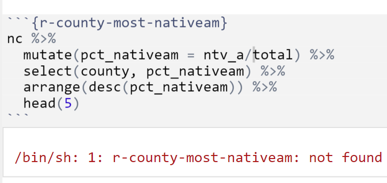
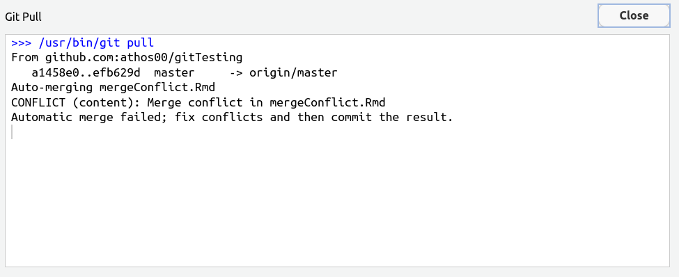
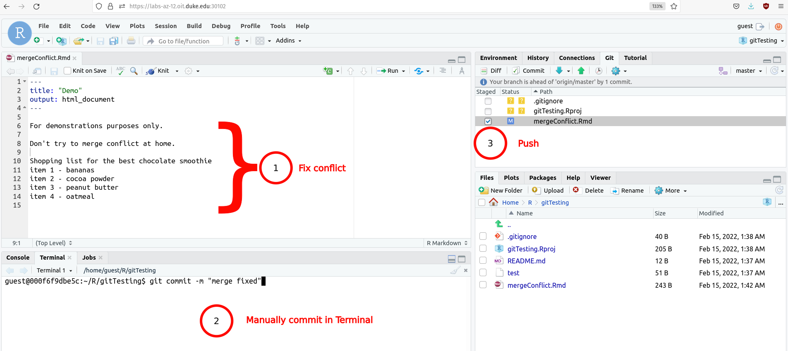

<!-- - [My push was rejected, what do I do?](#my-push-was-rejected-what-do-i-do) -->
<!-- - [Error: `/bin/sh: 1`?](#error-bin-sh) -->
<!-- - [Merge Conflict](#merge-conflict) -->

<!-- --- -->

## R syntax

<details><summary>What do you mean "assign"?</summary>
<p>

<h2>What do you mean "assign"?</h2>

- `name <- value` or `name = value`

- Using `<-` or `=` we assign a value to a name and **store** the name in Environment. 

- By calling `name` we can use the value repeatedly without typing it every time we use it. 

For example, in the following code chunk, having assigned `c(1,2,3)` to `x` makes the code more neat and tidy to get the same result. 

```{r ex-assign}
c(1,2,3)^2 + 2*c(1,2,3) - sqrt(c(1,2,3))

x <- c(1,2,3)
x^2 + 2*x - sqrt(x)
```


</p>
</details>


<details><summary>Why is `ggplot(data = mydata, mapping = aes(x = [x-variable], y = [y-variable]))` not enough to draw a plot?</summary>
<p>

<h2>Why is `ggplot()` not enough to draw a plot?</h2>

The function `ggplot()` is simply to tell `R` to **prepare** a canvas for a plot. It is a declaration that you will draw a plot. **What** you will draw on the canvas should be specified by `geom_xxxx()` functions, e.g. `geom_point` for scatterplots, `geom_bar` for bar plots, etc. 

You might think "...why? I even specified mapping variables there!"
Yes, I hear you. But, that is again a part of preparation for drawing a plot. We specify mapping variables in `ggplot()` so that it applies to all subsequent `geom_xxxx()` functions globally. 

</p>
</details>

<details><summary>I am confused about when to use `%>%` vs. `+`.</summary>
<p>

<h2>I am confused about when to use `%>%` vs. `+`.</h2>

- Are you manipulating data by creating a new variable, filtering rows, arranging rows, selecting columns, etc.? Then use `%>%`. 

- Are you working on plots? Use `+`. 

Remember, plotting is all about **adding** components of a graphic layer by layer. 

```{r}
knitr::include_graphics("img/grammar-of-graphics.png")
```

Once you declare your intention to draw a plot by typing `ggplot()`, every subsequent layer should be added by `+`. 

In the end, you will commonly write the code in the following structure: 

```{r, eval = FALSE}
data %>% 
  select() %>% 
  mutate() %>% 
  summarize() %>% # end of manipulation
  ggplot() + # beginning of drawing a plot 
  geom_whatever() + 
  facet_wrap() + 
  theme()
```

</p>
</details>

<details><summary>Where should I put `,`?</summary>
<p>

<h2>Where should I put `,`?</h2>

The comma `,` is used **within** a function, and it separates **inputs**. 

Let's check with `mean()`. We've seen two uses of `mean()` with or without `na.rm = TRUE`. 
If we want to include `na.rm = TRUE` we always put a comma in between:

```{r, eval = F}
mean(x)
mean(x, na.rm = TRUE)
```

## RStudio and Git troubleshooting

<details><summary>My push was rejected, what do I do?</summary>
<p>

<h2>My push was rejected, what do I do?</h2>

This question is relevant if you received an error message like the one below:


**Solution**: Git Pull. In the upper right box of RStudio select "Git" and then click the "Git Pull arrow" as seen in the red box below.



Now you should be able to push.

**Why did this error occur?** 

This error occurs when the repository is changed *remotely*. In other words, the GitHub repostiory contains content that you do not have on your local file system. For example, if you go to the repository and change the README file and commit your changes, you will receive this error and need to *pull* the remote changes before you can *push* your local changes again.


</p>
</details>


<details><summary>Error /bin/sh</summary>
<p>

<h2>Error /bin/sh</h2>

This question is relevant if you received an error message like the one below:



**Solution: **

Change the top of the code chunk to: `{r county-most-nativeam}`. Notice the space between `r` and the chunk-name.

**Why did this error occur?**

Code chunks in RStudio need to be explicitly told what language of code to run. In other programming contexts this information is sometimes referred to as a "shebang". This is why code chunks begin with `{r chunk-name}`. It is important for there to be a space after the `r`. If the chunk deviates from this format, you may encounter `/bin/sh : 1` error.

</p>
</details>

<details><summary>Merge conflict</summary>
<p>
<h2>Merge Conflict</h2>

This question is relevant if you received the following error when you tried to push:


Next, you git pull (the down arrow in the upper right) and receive the following error: "Automatic merge failed"


When you look at your `.Rmd`, the following lines show up:

```
<<<<<<<< (HEAD)

# YOUR CODE
============
# REMOTE CHANGES TO CODE

>>>>>>>>>> Commit Hash
```

like in the image below.


The solution is:

- fix the `.Rmd` to look like you want it to
- Go to the terminal tab in the bottom right and type `git commit -m "merge fixed"` and press enter
- Push as normal pressing the arrow in the upper right

See the picture below for details.



</p>
</details>

## Course logistics

<details><summary>How do I receive maximum workflow points? Re: What are tidyverse style guidelines?</summary>
<p>

<h2>How do I receive maximum workflow points? Re: What are tidyverse style guidelines?</h2>

Checklist:

0. Are all pages appropriately linked on Gradescope?

1. Is your name (and your team's name) on your document?
2. Did you commit >3 times? (Check your repo on GitHub)
3. Did every team member commit? (Also check on GitHub)
4. Is every code chunk named?

For tidyverse style guidelines: 

5. Are you under the 80 character code limit? (You shouldn't have to scroll to see all your code).
6. pipes `%>%` and ggplot layers `+` should be followed by a new line

[Click here](https://style.tidyverse.org/) for a full list of tidyverse style guidelines.

</p>
</details>

<!--

<details><summary>How do regrade requests work?</summary>
<p>

<h2>How do regrade requests work?</h2>
- After grades are released, there's a 48 hour period before regrade requests open up. This is to ensure people check the solutions on sakai / think about their regrade request before just auto posting a regrade request when points are taken off.
- Regrade requests serve the purpose of:
   - finding errors in grading, e.g. you have the correct answer but were incorrectly deducted points
   - explaining you found the correct answer (possibly using unconventional methods)

- Regrade requests are not for:
  - challenging the fairness of a question, please submit those comments directly to me via email and I'll follow-up
- After a regrade request is submitted, the problem goes back to the TA that graded the question. If they are confused and forward the question to me OR if you are unsatisfied with the response from a regrade request and send a message, I will regrade the whole problem personally (and this may result in gain or loss of points)
</p>
</details>
-->

