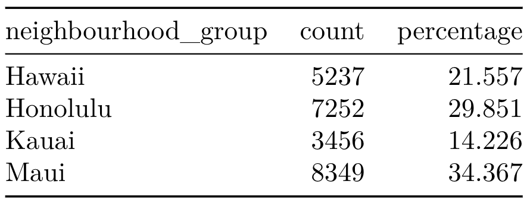
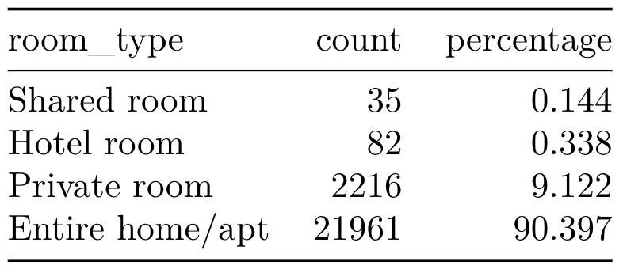
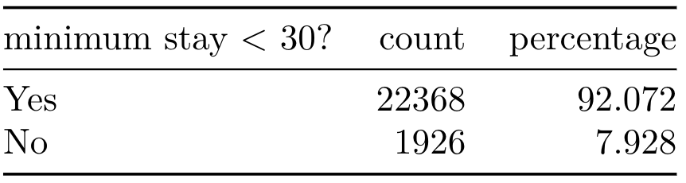

## Goals

-   Gain proficiency in data visualization and data-wrangling functions
-   Apply principles of effective data visualization to a real dataset
-   Answer real research questions using related datasets
-   Practice data science workflow using git and GitHub

## Getting started

- Go to [course GitHub organization page](https://github.com/sta199-summer22) and find the repository entitled "hw01-GitHubUsername"
- Clone the repo and make a new project in RStudio. 
- Find `hw01.Rmd` to open the template R Markdown file. 

## Formatting 

- All plots should follow best visualization practices; plots should include:

  - an informative title, 
  - axes that are labeled, and 
  - careful consideration should be given to aesthetic choices.
  - Please choose colorblind-friendly color maps such as `viridis`, `scico`, and many others.

- Place all plots in the center and properly adjust their size so that they are placed nicely in a written report. 

- Don’t forget to label your R chunk as well. Your label should be short, informative, shouldn’t include spaces, and shouldn’t repeat a previous label.

## Packages 

```{r load-package, message=FALSE, warning=FALSE}
library(tidyverse)
theme_set(theme_bw())
library(sf)
```

## Hawaii Airbnb Listings in 2021

The following data were originally distributed by [Inside Airbnb](http://insideairbnb.com/get-the-data) (date compiled: 11 Dec, 2021) and has been modified for the purpose of this homework.

We will work on two datasets, namely, `hawaii` and `hawaii_nb`. The dataset `hawaii` contains summary information and metrics for listings in Hawaii for the following variables: 

- `id`: ID number of the listing
- `host_id`: ID number for the host 
- `neighbourhood`: Neighbourhood the listing is located in
- `neighbourhood_group`: Neighbourhood group (major islands) the listing is located in
- `room_type`: Room type of the listing 
- `price`: Daily price in US dollar 
- `minimum_nights`: Minimum number of night stay for the listing
- `number of reviews`: Number of reviews the listing has in the last 12 months
- `bedrooms`: Number of bedrooms
- `review_scores_rating`: Average rating of the listing 

An `sf` object `hawaii_nb`contains geometry information on neighborhoods of Hawaii. 

**Note**: You do not have to worry about the last line in the code chunk below; 
it simply replaces column names with better understandable ones for future use. 

```{r load-data, message = FALSE}
hawaii <- read_csv("data/hawaii_airbnb.csv")
hawaii_nb <- st_read("data/hawaii_airbnb_neighborhood.shp", quiet = TRUE)
names(hawaii_nb)[1:2] <- c("neighbourhood", "neighbourhood_group")
```

1. How many observations (rows) does the dataset `hawaii` have? What does each row in the dataset represent? How many variables (columns) does `hawaii` have? Identify `review_scores_rating` and `room_type` as numeric continuous, numeric discrete, categorical ordinal, or categorical nominal.

::: {.commit}
`r emo::ji("yarn")` `r emo::ji("white_check_mark")` `r emo::ji("arrow_up")` Knit, commit, and push your final changes to GitHub with a meaningful commit message.
:::

2. Reproduce the following tables. The column "count" represents the number of listings, and "percentage" is the associated percentage. Hint: 

    - Include `knitr::kable(., digits = 3)` at the end of your pipeline to neatly display tables in your final document with numbers rounded to three decimal places. 
    - You may create a new variable using `ifelse()` for the column "minimum stay < 30?". 
    - When your variable name has space in between, you need quotation marks. 

```{r hw1-ex2, echo=FALSE, out.width = '75%', fig.align='center'}



```

::: {.commit}
`r emo::ji("yarn")` `r emo::ji("white_check_mark")` `r emo::ji("arrow_up")` Knit, commit, and push your final changes to GitHub with a meaningful commit message.
:::

3. Create a faceted histogram where each facet represents a neighborhood and displays the distribution of Airbnb prices in that neighborhood. In order to better understand the neighborhoods, fill histograms for neighborhoods in the same group (`neighbourhood_group`) in the same color. How would you describe the distribution of price in general? How do neighborhoods compare to each other in terms of price? 

    - Think critically about whether it makes more sense to stack the facets on top of each other in a column, lay them out in a row, or wrap them around. Along with your visualization, include your reasoning for the layout you chose for your facets. 
    - You should decide what makes a reasonable bin width for the histogram by trying out a few options.
    - You should decide if scales should be fixed or not. If the scales are fixed, every facet is drawn on the same ranges of x values and y values. 
    - Make sure your figure is large enough to properly display histograms for all facets. 

4. We will examine median listing prices of neighborhoods. 
    - Create a summary dataset called `hawaii_summary` with the minimum, mean, median, standard deviation, IQR, and maximum listing price in each neighborhood and identify neighborhoods with the top five median listing prices.
    - Create a new `sf` object `hawaii_sf` that includes all rows and columns from `hawaii_summary` and the associated geometry information from `hawaii_nb`. 
    - Create a map of Hawaii where each neighborhood is colored by the level of its median listing price using `scale_fill_gradient`. Describe what you observe. 

::: {.commit}
`r emo::ji("yarn")` `r emo::ji("white_check_mark")` `r emo::ji("arrow_up")` Knit, commit, and push your final changes to GitHub with a meaningful commit message.
:::

5. Now you will meet the Airbnb hosts in Hawaii. 
    - How many hosts are there in Hawaii? 
    - Using one pipeline: 
      - create a new variable `annual_revenue` that estimates the annual revenue for the listing in the last 12 months. You may assume that visitors always left a review and stayed in the listing for minimum nights only. Hint: use `minimum_nights`, `price` and `number_of_reviews`. 
      - calculate the sum of the estimated annual revenue and the number of listings by each of the hosts identified by `host_id`.
      - create a scatterplot illustrating the two variables' relationship. Put the number of listings on x-axis. Use `geom_smooth()` for a fitted line. 
    - Interpret your visualization.
    - Are there any outliers? If so, identify them. 

::: {.commit}
`r emo::ji("yarn")` `r emo::ji("white_check_mark")` `r emo::ji("arrow_up")` Knit, commit, and push your final changes to GitHub with a meaningful commit message.
:::

6. Come up with a question you want to answer using these data, and write it down. Then, answer it using summary statistic(s) and/or visualization(s). 

::: {.commit}
`r emo::ji("yarn")` `r emo::ji("white_check_mark")` `r emo::ji("arrow_up")` Knit, commit, and push your final changes to GitHub with a meaningful commit message.
:::

## Submission

Knit to PDF to create a PDF document. Stage and commit all remaining
changes, and push your work to GitHub. Make sure all files are updated
on your GitHub repo.

Only upload your PDF document to Gradescope. Before you submit the
uploaded document, mark where each answer is to the exercises. If any
answer spans multiple pages, then mark all pages. Associate the
*"Workflow & formatting"* section with the first page.

## Grading (60 pts)

<br>

| Component | Points |
|:----------|:-------|
| Ex 1      | 5      |
| Ex 2      | 8      |
| Ex 3      | 8      |
| Ex 4      | 15     |
| Ex 5      | 8      |
| Ex 6      | 6      |
| Workflow & formatting   | 10      |

**Grading notes**:

- The "Workflow & formatting" grade is to assess the reproducible workflow. This includes updating the name on the assignment to your name, having at least 3 informative commit messages, labeling the code chunks, using tidyverse style throughout, and following best visualization practices. 

