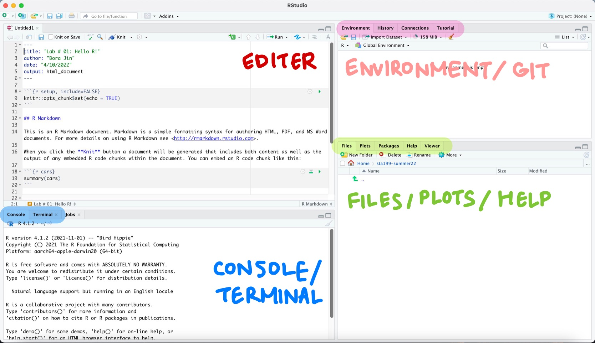
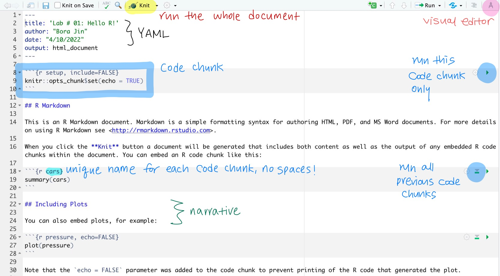

This lab will go through the same workflow as class with R / RStudio and git / GitHub.

Remember, git is a version control system (like "Track Changes" from Microsoft Word but more powerful) and GitHub is the home for your Git-based projects on the internet (like DropBox but much better).

In future labs, you will be encouraged to explore independently.

But first, you need to build basic fluency in R.

**Your lab TA will lead you through the Getting Started section**

# Getting started

## Clone the repo & start new RStudio project

- Go to [course GitHub organization page](https://github.com/sta199-summer22) and find the repository entitled "lab01-GitHubUsername"
- Clone the repo and make a new project in RStudio. 
- Find `lab01.Rmd` to open the template R Markdown file. 

**More detailed steps are described in** [AE 02: Part 1, Tour of RStudio + GitHub](https://sta199-summer22.netlify.app/appex/ae02_BJ.html)

## Possible Error Message

If you get an error message that begins with *WARNING: UNPROTECTED PRIVATE KEY FILE!* then this can be fixed by clicking on "Terminal" (the tab next to the console) and pasting in `chmod 400 ~/.ssh/id_rsa` and hitting enter.
Then, try to create a project again and it should work.

## R and R Studio





## Warm up

Before we introduce the data, let's warm up with some simple exercises.
We're going to go through our first **commit** and **push**.

## YAML

The top portion of your R Markdown file (between the three dashed lines) is called YAML.
It stands for "YAML Ain't Markup Language".
It is a human friendly data serialization standard for all programming languages.
All you need to know is that this area is called the YAML (we will refer to it as such) and that it contains meta information about your document.

Open the R Markdown (Rmd) file in your project, change the author name to your name, and knit the document.
Examine the knitted document.

## Commiting changes

Now, go to the Git pane in your RStudio instance.
This will be in the top right hand corner in a separate tab.

If you have made changes to your Rmd file (and saved those changes), you should see it listed here.
Click on it to select it in this list and then click on **Diff**.
This shows you the *diff*erence between the last committed state of the document and its current state including changes.
You should see deletions in red and additions in green.

If you're happy with these changes, we'll prepare the changes to be pushed to your remote repository.
First, **stage** your changes by checking the appropriate box on the files you want to prepare.
Next, write a meaningful commit message (for instance, "updated author name") in the **Commit message** box.
Finally, click **Commit**.
Note that every commit needs to have a commit message associated with it.

You don't have to commit after every change, as this would get quite tedious.
You should commit states that are *meaningful to you* for inspection, comparison, or restoration.
In the first few assignments we will tell you exactly when to commit and in some cases, what commit message to use.
As the semester progresses, you will make these decisions on your own.

## Pushing changes

Now that you have made an update and committed this change, it's time to push these changes to your repo on GitHub.

In order to push your changes to GitHub, you must have **staged** your **commit** to be pushed.
click on **Push**.

# Packages

In this lab we will work with two packages: `datasauRus` which contains the dataset, and `tidyverse` which is a collection of packages for doing data analysis in a "tidy" way.

If you want, you can **Knit** your template document and see the results.

The packages we are using should already be installed and only need to be loaded. 

```{r library, warning=FALSE, message=FALSE}
library(tidyverse) 
library(datasauRus)
```

# Datasaurus Data

The data frame we will be working with today is called `datasaurus_dozen` and it's in the `datasauRus` package.
Actually, this single data frame contains 13 datasets, designed to show us why data visualization is important and how summary statistics alone can be misleading.
The different datasets are marked by the `dataset` variable.

To find out more about the dataset, type the following in your **console**.

```{r find-more, eval=FALSE}
?datasaurus_dozen
```

1.  Based on the help file, how many rows and how many columns does the `datasaurus_dozen` file have? What are the variables included in the data frame? Add your responses to your lab report. 

Let's take a look at what these datasets are.
To do so we can make a *frequency table* of the dataset variable.
Run the code chunk below.

```{r explore}
datasaurus_dozen %>%
  count(dataset) 
```

The original Datasaurus (`dino`) was created by Alberto Cairo in [this great blog post](http://www.thefunctionalart.com/2016/08/download-datasaurus-never-trust-summary.html).
The other Dozen were generated using simulated annealing and the process is described in the paper *Same Stats, Different Graphs: Generating Datasets with Varied Appearance and Identical Statistics* through Simulated Annealing by Justin Matejka and George Fitzmaurice.
In the paper, the authors simulate a variety of datasets that the same summary statistics to the Datasaurus but have very different distributions.

::: {.commit}
`r emo::ji("yarn")` `r emo::ji("white_check_mark")` `r emo::ji("arrow_up")` Knit, commit, and push your changes to GitHub with the commit message "Added answer for Ex 1".
Make sure to commit and push all changed files so that your Git pane is cleared up afterwards.\*\*
:::

# Data visualization and summary

2.  Plot `y` vs. `x` for the `dino` dataset. Then, calculate the correlation coefficient between `x` and `y` for this dataset.

Below is the code you will need to complete this exercise.
Basically, the answer is already given, but you need to include relevant bits in your Rmd document and successfully knit it and view the results.

Start with the `datasaurus_dozen` and **pipe** it into the `filter` function to filter for observations where `dataset == "dino"`.
Store the resulting filtered data frame as a new data frame called `dino_data`.

```{r filter-dino}
dino_data <- datasaurus_dozen %>%
  filter(dataset == "dino")
```

There is a lot going on here, so let's slow down and unpack it a bit.

First, the pipe operator: `%>%`, takes what comes before it and sends it as the first argument to what comes after it.
So here, we're saying `filter` the `datasaurus_dozen` data frame for observations where `dataset == "dino"`.

Second, the assignment operator: `<-`, assigns the name `dino_data` to the filtered data frame.

Next, we need to visualize these data.
We will use the `ggplot` function for this.
Its first argument is the data you're visualizing.
Next we define the `aes`thetic mappings.
In other words, the columns of the data that get mapped to certain aesthetic features of the plot, e.g. the `x` axis will represent the variable called `x` and the `y` axis will represent the variable called `y`.
Then, we add another layer to this plot where we define which `geom`etric shapes we want to use to represent each observation in the data.
In this case we want these to be points, hence `geom_point`.

```{r plot-dino, fig.width = 6}
ggplot(data = dino_data, mapping = aes(x = x, y = y)) +
  geom_point()
```

For the second part of this exercise, we need to calculate a summary statistic: the correlation coefficient.
The correlation coefficient (r) measures the strength and direction of the linear association between two variables.
You will see that some of the pairs of variables we plot do not have a linear relationship between them.
This is exactly why we want to visualize first: visualize to assess the form of the relationship, and calculate $r$ only if relevant.
In this case, calculating a correlation coefficient really doesn't make sense since the relationship between `x` and `y` is definitely not linear.

For illustrative purposes only, let's calculate the correlation coefficient between `x` and `y`.

```{r cor-dino}
dino_data %>%
  summarize(r = cor(x, y))
```

::: {.commit}
`r emo::ji("yarn")` `r emo::ji("white_check_mark")` `r emo::ji("arrow_up")` Now pause, knit and commit changes with the commit message "Added answer for Ex 2". Push these changes when you're done.
:::

3.  Plot `y` vs. `x` for the `star` dataset. You can (and should) reuse code we introduced above, just replace the dataset name with the desired dataset. Then, calculate the correlation coefficient between `x` and `y` for this dataset. How does this value compare to the `r` of `dino`?

::: {.commit}
`r emo::ji("yarn")` `r emo::ji("white_check_mark")` `r emo::ji("arrow_up")` Now pause, knit, commit changes with the commit message "Added answer for Ex 3", and push.
:::

```{marginfigure}
Facet by the dataset variable, placing the plots in a 3 column grid, and don't add a legend. 
```

Finally, let's plot all datasets at once.
In order to do this we will make use of faceting, given by the code below:

```{r plot-all, eval=FALSE, fig.fullwidth=TRUE}
ggplot(datasaurus_dozen, 
       aes(x = x, y = y, color = dataset)) +
  geom_point() +
  facet_wrap(~ dataset, ncol = 3) +
  theme(legend.position = "none")
```

And we can use the `group_by` function to generate all the summary correlation coefficients.
We'll go through these functions next week when we learn about data wrangling.

```{r cor-all, eval=FALSE}
datasaurus_dozen %>%
  group_by(dataset) %>%
  summarize(r = cor(x, y)) 
```

4.  Include the faceted plot and the summary of the correlation coefficients in your lab write-up by including relevant code in R chunks (give them appropriate names). In the narrative below the code chunks, *briefly* comment on what you notice about the plots and the correlations between `x` and `y` values within each of them (one or two sentences is fine!).

::: {.commit}
`r emo::ji("yarn")` `r emo::ji("white_check_mark")` `r emo::ji("arrow_up")`Now is another good time to knit and commit changes with the commit message "Added answer for Ex 4", and push.
:::

You're done with the data analysis exercises, but we'd like to do one more thing to customize the look of the report.

## Resize your figures

We can customize the output from a particular R chunk by including options in the header that will override any global settings.

5.  In the R chunks you wrote for Exercises 2-4, customize the settings by modifying the **options** in the R chunks used to create those figures.

For Exercises 2 and 3, we want square figures.
We can use `fig.height` and `fig.width` in the options to adjust the height and width of figures.
Modify the chunks in Exercises 2 and 3 to be as follows:

```` ```{r ex2-chunk-name, fig.height = 3, fig.width = 3} ````

```{r, eval = FALSE}
Your code that created the figure
```

```` ``` ````

**For Exercise 4, please modify your figure to have `fig.height` of 8 and `fig.width` of 6.**

Now, save and knit.
Once you've created this .pdf file, you're done!

::: {.commit}
`r emo::ji("yarn")` `r emo::ji("white_check_mark")` `r emo::ji("arrow_up")` Knit and commit all remaining changes, use the commit message "done with lab 1!" and push.
:::

# Submission

In this class, we'll be submitting .pdf documents to Gradescope.
Once you are fully satisfied with your lab, **Knit to .pdf** to create a .pdf document.
You may notice that the formatting/theme of the report has changed -- this is expected.

**Before you wrap up the assignment, make sure all documents are updated on your GitHub repo. We will be checking these to make sure you have been practicing how to commit and push changes.** 

Once your work is finalized in your GitHub repo, you will submit it to Gradescope.

**Remember -- you must turn in a .pdf file to the Gradescope page before the submission deadline for full credit.** 

To submit your assignment: 

- Go to <http://www.gradescope.com> and click *Log in* in the top right corner.
- Click *School Credentials* $\rightarrow$ *Duke NetID* and log in using your NetID credentials.
- Click on your *STA 199* course.
- Click on the assignment, and you'll be prompted to submit it.
- Mark the pages associated with each exercise, 1 - 4.
All of the papers of your lab should be associated with at least one question (i.e., should be "checked").
- Select the first page of your .pdf submission to be associated with the *"Workflow and formatting"* section.

# Grading (50 pts)

<br>

| Component | Points |
|:----------|:-------|
| Ex 1      | 7      |
| Ex 2      | 10     |
| Ex 3      | 11     |
| Ex 4      | 14     |
| Workflow & formatting   | 8      |

**Grading notes**:

- Workflow and formatting includes the number of commits made, naming chunks, and updating the name on the assignment to your name.

- Note: the points for resizing are part of the total for the other exercises.

<hr>

### Acknowledgements

This lab was adapted from a lab in [Data Science in a Box](https://datasciencebox.org/).
