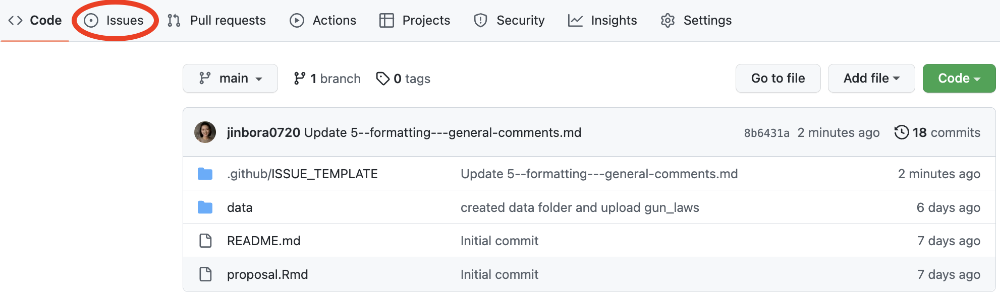
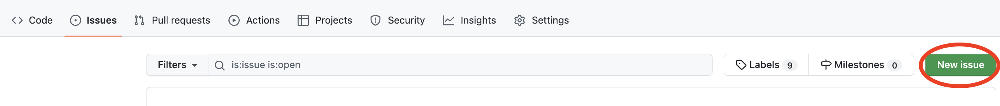
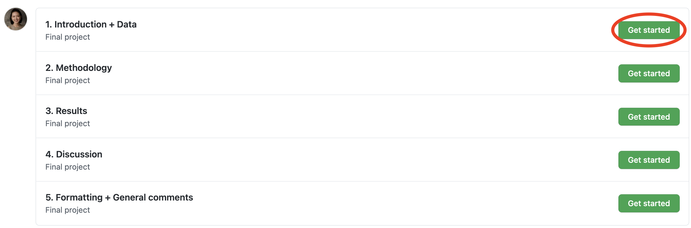
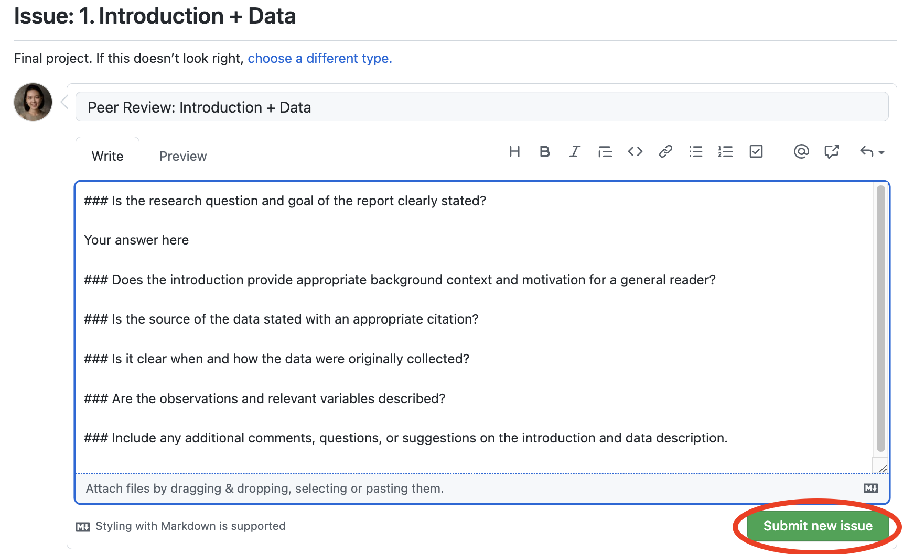

```{r include=FALSE}
library(tidyverse)
library(tufte)
library(knitr)
options(
  htmltools.dir.version = FALSE, # for blogdown
  show.signif.stars = FALSE,     # for regression output
  digits = 2
  )
knitr::opts_chunk$set(eval = FALSE)
```

# Steps for creating GitHub issues

Carefully read the project draft of your partner team, and 
consider the questions below as you read it. 

Once you've read the draft, you will submit the review for each part by opening 
new **Issues** in the partner team's repo. To open and submit an issue: 

- Go to the partner team's repo and click **Issues**. 



- Click **New issue**. 



- You will see one template for each part of the peer review. 
Click **Get started** and it will open a new issue. 



- Type your response to each question. 

- When you've completed the review, click **Submit new issue**, and you are done 
with that part of the review. 



- Repeat this for all parts of the review.

# Peer review questions

Your response to each question in the peer review has two parts:

`r emo::ji("one")` Selection of one of the following: 
  
  - **Yes**: The item is clearly and accurately completed in the draft. 
  - **Somewhat**: There is an attempt to complete the item in the draft; however, 
  it is incomplete or there are some inaccuracies. 
  - **No**: There is no attempt to complete the item in the draft, or there 
  are major inaccuracies. 

`r emo::ji("two")` Brief comment about your selection.
  
  - If you responded **Yes**, briefly summarize the answer from the draft. 
  For example, if you answer **yes** that the draft includes citations for outside 
  research, briefly summarize what the outside research is.
  - If you responded **Somewhat** or **No**, briefly summarize what is incomplete 
  or inaccurate. In other words, briefly summarize why you did not respond 
  Yes to that item.

## 1. Introduction + Data

- Is the research question and goal of the report clearly stated? 
- Does the introduction provide appropriate background context and 
motivation for a general reader?
- Is the source of the data stated with an appropriate citation? 
- Is it clear when and how the data were originally collected?
- Are the observations and relevant variables described?
- Include any additional comments, questions, or suggestions on the introduction 
and data description. 

## 2. Methodology

- Is the data cleaning and data wrangling clearly described? This includes dealing with missing data, creating new variables, etc.
- Do the visualizations follow the guidelines we’ve discussed in STA 199? This includes using plots that are appropriate for the data, having proper axis labels, titles, etc.
- Are any tables and figures clear, effective, and informative? Should any be eliminated, or are any new tables or figures needed?
- Are the chosen methods (e.g. hypothesis testing, confidence intervals, models, etc.) for answering the research question appropriate for the research context and type of data?
- Include any additional comments, questions, or suggestions for the methodology.

## 3. Results

- Is the research question answered accurately and effectively?
- Is the answer to the research question summarized and supported by statistical arguments?
- Include any additional comments, questions, or suggestions for the results.

## 4. Discussion 

- Is the conclusion of the analysis concisely summarized?
- Are limitations of their own research regarding data or methods discussed?
- Are any suggestions for future research or improvement of the analysis provided? 
- Include any additional comments, questions, or suggestions for the discussion.

## 5. Formatting + General comments 

- Is the paper professionally presented and generally free of distracting errors or other issues, including (but not limited to) insufficient organization or formatting; poor grammar, spelling, or punctuation; or too-small font? Is the overall paper easily readable for someone with your expert level of knowledge? Note any concerns here.
- Knit the .Rmd file. Are you able to reproduce all aspects of the report, including output, visualizations, etc? This includes (1) being able to knit the document and (2) obtaining the same PDF as the original PDF.
- What questions and/or general feedback do you have for the authors?

# Applying what you’ve learned to your project

**Discuss the following as a group. You do not need to submit a response to this question.**

After giving feedback to this group, what is one thing you want to change 
or continue working on for your report?

