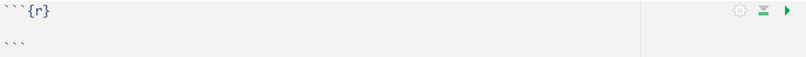

```{r child = "setup.Rmd"}
```

```{r echo=FALSE, message=FALSE, warning=FALSE}
library(tidyverse)
```


## Material 

`r emo::ji("movie_camera")` Watch [Meet the Toolkit - Programming](https://youtu.be/Q2QN1RpvLq8) 

- [Slides](https://rstudio-education.github.io/datascience-box/course-materials/slides/u1-d02-toolkit-r/u1-d02-toolkit-r.html#1)

`r emo::ji("movie_camera")` Watch [Meet the Toolkit - Version Control and Collaboration](https://youtu.be/124DQasLyNQ)  

- [Slides](https://rstudio-education.github.io/datascience-box/course-materials/slides/u1-d03-toolkit-git/u1-d03-toolkit-git.html#1)

---

## Today's Goal 

- Understand reproducibility and version control 
- Comfortably navigate RStudio fundamentals
- Be able to define common terms including: **data frame**, **function**, **variable**, **package**
- Interact with Git from RStudio (committing and pushing)
- Use a few functions, including: `glimpse()`, `group_by()`, `summarize()`, and `filter()`
- Understand the pipe operator `%>%`
- Create a reproducible report via today's application exercise using R Markdown

---

## Quiz

**Q - What is a reproducible data analysis?** <br>

--

Near-term goals:

- Exact/similar tables and figures can be generated from the code and data
- The code performs an intended task
- Purpose of the analysis is clear

Long-term goals:

- The code can be used for other data
- The code can be extended to do other things

---

## Quiz

**Q - What is difference between R vs. RStudio?** <br>

--

 R:
- Open-source statistical programming language 
- Easily extensible with **packages**, collections of reproducible R code

RStudio: 
- Convenient interface for R called Integrated development environment (IDE)

---

## Quiz

**Q - How do I install a package called** `unvotes` **and load it?** <br>

--

```{r eval = FALSE}
install.packages("unvotes")
library(unvotes)
```

--

**Q - How do I see a help page of data ** `un_votes`**?** <br>

--
```{r eval = FALSE}
?un_votes
```

--

**Q - What am I doing with** `un_votes$country`**?** <br>

--

Accessing a column `country` in the data `un_vote`

---

## Quiz

**Q - What can you do with R Markdown?** <br>

--

- Create fully reproducible reports with code for analysis and text for narrative 
- Every assignment as an R Markdown document (with `.Rmd` extension)
- R Markdown document should be complete in itself. *The environment of your R Markdown document is separate from the R Console!*

--

**Q - How do I create a code chunk in an R Markdowm document?** <br>

--

Three backticks

```{r echo=FALSE, out.width="100%", fig.align = 'left'}

```

---

## Quiz

**Q - What is difference between Git vs. GitHub?** <br>

--

- Git: Version control system 
- GitHub: Home for Git-based projects on the internet 

--

**Q - What is version control?** <br>

--

Tracking changes (potentially with human readable messages) 

--

**Q - Why is it important?** <br>

--

- Otherwise you lose track of your work and become clueless where to go back when you need to fix things! e.g. final.docx, final2.docx, final_final.docx, final_final_XXXX.docx, ...
- At each version, important to leave an informative tag

---

class: middle, center

# Questions?

---

## Let's Practice Together! 

Go to [AE 02: Part 1, Tour of RStudio + GitHub](https://sta199-summer22.netlify.app/appex/ae02_BJ.html)

---

## For Tomorrow 

- Watch videos for [Prepare: May 13](https://sta199-summer22.netlify.app/prepare/week01_may13_BJ.html)

- Submit your `ae02`.

