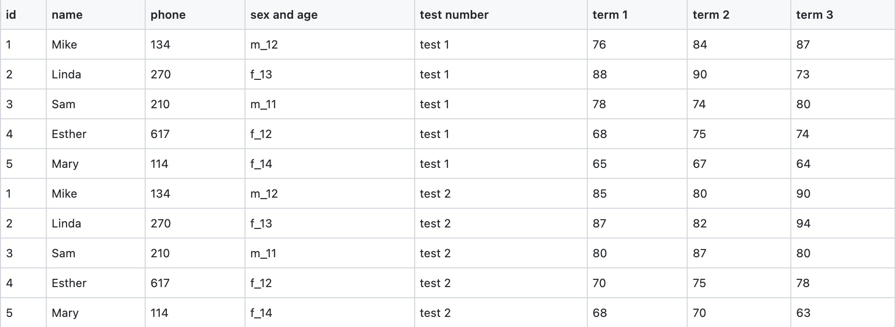
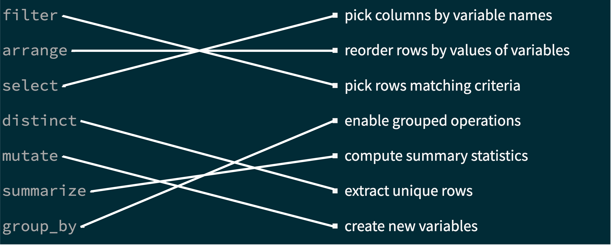

```{r child = "setup.Rmd"}
```

```{r echo=FALSE, message=FALSE, warning=FALSE}
library(tidyverse)
```

## Material 

`r emo::ji("movie_camera")` Watch [Tidy Data](https://youtu.be/Ux85eR3h9hw)

- [Slides](https://rstudio-education.github.io/datascience-box/course-materials/slides/u2-d05-tidy-data/u2-d05-tidy-data.html#1)

`r emo::ji("movie_camera")` Watch [Grammar of Data Wrangling](https://youtu.be/ZCaYBES_VEk)

- [Slides](https://rstudio-education.github.io/datascience-box/course-materials/slides/u2-d06-grammar-wrangle/u2-d06-grammar-wrangle.html#1)

`r emo::ji("movie_camera")` Watch [Working With a Single Data Frame](https://youtu.be/0229Uq2hkJo)

- [Slides](https://rstudio-education.github.io/datascience-box/course-materials/slides/u2-d07-single-df/u2-d07-single-df.html#1)

---

## Today's Goal 

- Understand how data are organized according to a consistent set of "tidy" principles
- Use **seven key verbs** to wrangle data and extract meaning

"Happy families are all alike; every unhappy family is unhappy in its own way" - Leo Tolstoy

---

## Quiz 

Tidy data has three related characteristics

1. Each variable forms a column.
2. Each observation forms a row.
3. Each value has its own cell.

--

**Q - A tidy data set is tidy for any analyses (T/F).**

--

F
---

## Quiz 

**Q - What makes this data not tidy?**

```{r echo=FALSE, out.width="100%", fig.align = 'left', fig.cap = "source: https://gist.github.com/Kimmirikwa/b69d0ea134820ea52f8481991ffae93e#file-student_results-csv"}

```

---

## Quiz 

**Q - What makes this data not tidy?**

1. `sex and age`: multiple variables in one column
2. `test number`: not a value for each observation, `test 1` and `test 2` should be a variable 
3. `term 1-3`: can be aggregated 

|id | name | phone | sex | age | test1 | test2 | term |
|:--|:-----|:------|:----|:----|:------|:------|:-----|
| 1 | Mike | 134   |  m  | 12  |  76   |  85   | term1|
| 1 | Mike | 134   |  m  | 12  |  84   |  80   | term2|
| 1 | Mike | 134   |  m  | 12  |  87   |  90   | term3|

---

## Quiz

**Q - Correct the following sentences about** `dplyr` **functions:**

a. Its input can be a matrix.

b. Its output is in various forms. 

c. Functions are nouns. 

d. Replace the input data frame. 

---

## Quiz

**Q - Correct the following sentences about** `dplyr` **functions:**

a. Its input should be a **data frame**.

b. Its output is always a **data frame**. 

c. Functions are **verbs**. 

d. **Do not modify** the input data frame. 

---

## Quiz

**Q - Whic of these is the most appropriate translation of ** `%>%` **in English?**

a. Before 

b. Which 

c. Then

d. Do

---

## Quiz

**Q - What of these is the most appropriate translation of ** `%>%` **in English?**

a. Before 

b. Which 

**c. Then**

d. Do

---

## Quiz

**Q - Connect each function to its effect.**

.pull-left[
`filter` - 

`arrange` -

`select` - 

`distinct` - 

`mutate` - 

`summarize` - 

`group_by` - 

]

.pull-right[
- pick columns by variable names 

- reorder rows by values of variables 

- pick rows matching criteria 

- enable grouped operations

- compute summary statistics 

- extract unique rows

- create new variables 

]

---

## Quiz 

**Q - Connect each function to its effect.**  <br>

```{r echo=FALSE, out.width="100%", fig.align = 'center'}

```

---

class: middle, center

# Questions?

---

## Let's Practice Together! 

Go to [AE 05: Data Wrangling 1](https://sta199-summer22.netlify.app/appex/ae05_BJ.html)

---

## Bulletin

- Watch videos for [Prepare: May 18](https://sta199-summer22.netlify.app/prepare/week02_may18_BJ.html)

- Make sure you commit **at least 3 times** for AEs 

  - Cannot give full credit for fewer than 3 commits from `ae03`

- Submit your `ae04`

- Submit your `ae05`

